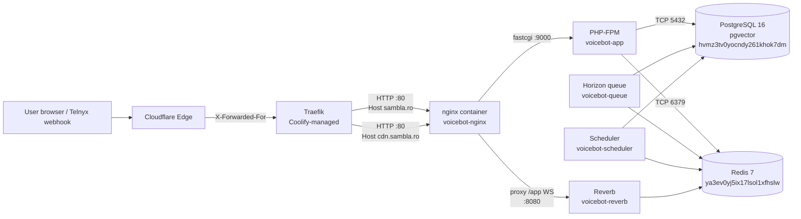

# Infrastructure

## TL;DR

Sambla is a Laravel 11 / PHP 8.3 multi-tenant SaaS deployed as a five-container Docker stack (`app`, `nginx`, `queue`, `scheduler`, `reverb`) behind Coolify-managed Traefik on a single Ubuntu 24.04 host (`185.104.181.113`). TLS is terminated at Cloudflare and again at Traefik; internal traffic between Traefik → nginx → PHP-FPM is plaintext inside the shared `coolify` Docker network. Persistent state lives in two Coolify-managed containers (PostgreSQL 16 + pgvector, Redis 7) plus two host-bind mounts on dedicated SSD/HDD volumes for generated media and backups. Deploys are git-driven: `git push origin master` → Coolify builds the image from the repo's [`Dockerfile`](../../Dockerfile) and recreates the five services with the compose definition at [`docker-compose.yml`](../../docker-compose.yml). The built-in Laravel health endpoint `/up` is wired in [`bootstrap/app.php:13`](../../bootstrap/app.php).

## Runtime topology



All five app containers share the external `coolify` network plus a stack-local `default` network (see [`docker-compose.yml:160-163`](../../docker-compose.yml)). Traefik only attaches to `voicebot-nginx` (sole `traefik.enable=true` label, [`docker-compose.yml:57`](../../docker-compose.yml)); every other service is marked `traefik.enable=false` so it never leaks outside the network boundary.

## Services

| Name                | Image / build                                              | Role                                                                 | Ports (container) | Healthcheck                                                        |
|---------------------|------------------------------------------------------------|----------------------------------------------------------------------|-------------------|--------------------------------------------------------------------|
| `voicebot-app`      | `Dockerfile` (php:8.3-fpm-alpine)                          | PHP-FPM request handler; built Vite bundle, composer-autoloaded      | 9000 (internal)   | `php-fpm-healthcheck` via FastCGI `/ping` ([Dockerfile:26-28](../../Dockerfile), [compose:25-30](../../docker-compose.yml)) |
| `voicebot-nginx`    | `docker/nginx/Dockerfile` (nginx:alpine + baked `public/`) | Static asset server, FastCGI to `app:9000`, WS reverse proxy for `/app` | 80 (exposed)      | Implicit (Traefik backend health)                                  |
| `voicebot-queue`    | Same as `app`                                              | Runs migrations then `php artisan horizon` (chat+knowledge queues)   | none              | None; relies on Horizon's internal supervisor                      |
| `voicebot-scheduler`| Same as `app`                                              | `while true; schedule:run; sleep 60` loop                            | none              | None                                                               |
| `voicebot-reverb`   | Same as `app`                                              | Laravel Reverb WebSocket server on `:8080`                           | 8080 (internal)   | None (nginx probes it on first upgrade)                            |

Horizon replaces the raw `queue:work` workers; see [`config/horizon.php`](../../config/horizon.php) for the `chat-workers` (high, default) and `knowledge-workers` pools referenced in `DEPLOYMENT.md`. The legacy [`docker/supervisor/supervisord.conf`](../../docker/supervisor/supervisord.conf) is not used in production — Coolify executes the `command:` from `docker-compose.yml` directly.

The `app` and `nginx` containers share three host-bind mounts so the queue can write files that the web tier immediately serves ([compose:8-19](../../docker-compose.yml), [compose:47-52](../../docker-compose.yml)):

- `/mnt/ssd-cdn/social` → `public/social/` — AI-generated social images (immutable, 1y cache).
- `/mnt/ssd-cdn/uploads` → `public/uploads/` — tenant uploads.
- `/home/sambla/ancpi/public` → `public/ancpi/` — cadastral viewer living outside the project tree.

The `cdn.sambla.ro` vhost ([`docker/nginx/default.conf:1-119`](../../docker/nginx/default.conf)) serves only whitelisted static paths from the same `public/` root with long-lived, immutable cache headers. Anything else on that host returns 404 — no PHP, no directory listing.

## Trusted proxy ranges

Laravel sits three proxy hops in (Cloudflare → Traefik → nginx), so every incoming request arrives with a Docker-internal source IP unless we tell the framework otherwise. The middleware pipeline in [`bootstrap/app.php:21-53`](../../bootstrap/app.php) calls `trustProxies(at: [...])` with:

- `127.0.0.1` plus the three RFC1918 ranges (`10.0.0.0/8`, `172.16.0.0/12`, `192.168.0.0/16`) so Docker bridge IPs (Traefik, the `coolify` overlay) are accepted.
- Cloudflare's published IPv4 prefixes (17 ranges, `173.245.48.0/20` … `131.0.72.0/22`) and IPv6 prefixes (7 ranges, `2400:cb00::/32` … `2c0f:f248::/32`).

We trust `X-Forwarded-For`, `X-Forwarded-Host`, `X-Forwarded-Port`, and `X-Forwarded-Proto` headers ([`bootstrap/app.php:50-53`](../../bootstrap/app.php)). The explicit list replaced an earlier `*` wildcard — with a wildcard any client could spoof `X-Forwarded-For` and bypass rate limits / audit logs, so narrowing it to Cloudflare + Docker was a correctness fix, not a hardening extra. When Cloudflare rotates its prefix list (rare but it happens), this array MUST be updated in lockstep.

The matching nginx layer re-asserts `HTTP_X_FORWARDED_PROTO https` on every FastCGI hop ([`docker/nginx/default.conf:250,283,317`](../../docker/nginx/default.conf)) so Laravel generates `https://` URLs even though the PHP-FPM socket is plaintext.

## Storage + volumes

- `app-storage` named volume (declared [`docker-compose.yml:157-158`](../../docker-compose.yml)) — Laravel `storage/` tree. Mounted RW in `app`, `queue`, `scheduler`; RO in `nginx`. Holds logs, framework cache, session files.
- `/var/www/voicebot-saas` host bind into `/var/www/html` on `app`, `queue`, `scheduler` — this is why a `git pull` on the host is reflected in those containers without a rebuild, but nginx keeps serving the baked `public/` from its own image layer until redeployed.
- `/mnt/ssd-cdn/{social,uploads}` — dedicated SSD for AI-generated media; keeps growing files off the root disk and lets us move to an object store / CDN later without app changes.
- `/mnt/hdd-backup` → `/backups` on `scheduler` ([compose:119](../../docker-compose.yml)) — destination for `db:backup` artifacts.
- PostgreSQL (`hvmz3tv0yocndy261khok7dm`) and Redis (`ya3ev0yj5ix17lsol1xfhslw`) are Coolify-managed containers on the same host, attached to the `coolify` network. Their data volumes are managed outside this repo. Credentials live in `.env.coolify` (NOT in git, per [`CLAUDE.md`](../../CLAUDE.md)).

## Deployment flow

Coolify project UUID `ld7mc5p77cpreg8dhqud53es` (from [`DEPLOYMENT.md:86`](../../DEPLOYMENT.md)) watches the `master` branch.

1. Developer runs `npm run build` locally — `public/build/` is tracked in git so Tailwind doesn't have to build inside Alpine (known to produce incomplete CSS).
2. `git push origin master`.
3. Coolify pulls, runs `docker compose build` using the repo `Dockerfile` + `docker/nginx/Dockerfile`. Vite build args (`VITE_REVERB_*`) are injected at build time ([`Dockerfile:54-64`](../../Dockerfile)) because runtime env vars are too late — the bundle is already minified.
4. Coolify recreates the five containers with healthcheck gating (`nginx` waits for `app` to report healthy, [`docker-compose.yml:53-55`](../../docker-compose.yml)).
5. The `queue` service runs `php artisan migrate --force && view:clear && horizon` as its start command ([`docker-compose.yml:85`](../../docker-compose.yml)), so migrations are applied exactly once per deploy by whichever replica starts first.
6. Post-deploy smoke: `curl -s https://sambla.ro/up` should return HTTP 200 with Laravel's built-in health payload (registered in [`bootstrap/app.php:13`](../../bootstrap/app.php)).

Coolify does NOT execute `Dockerfile` `CMD` overrides via s6 — it runs the compose `command:` verbatim. The `supervisord.conf` file in the repo is legacy.

## Gotchas

- **`pg_dump` is missing from `app`.** The Dockerfile installs `postgresql-dev` (headers only) but not the `postgresql-client` package, so `php artisan db:backup` shelling out to `pg_dump` fails inside the container. Backups run from the host or a sidecar; fix by adding `postgresql-client` to the `apk add` line in [`Dockerfile:5-13`](../../Dockerfile).
- **`public/build/` must be committed.** Alpine npm produces broken Tailwind output if built inside the image without the build-args plumbing. Workflow rule in [`DEPLOYMENT.md:45-48`](../../DEPLOYMENT.md).
- **nginx bakes `public/` into its own image** ([`docker/nginx/Dockerfile:3`](../../docker/nginx/Dockerfile)). Editing a file under `public/` on the host does NOT change what nginx serves until a rebuild — but `app`/`queue`/`scheduler` see the host copy via the bind mount, leading to asset-manifest skew if you forget to rebuild nginx.
- **ANCPI bind mount is mandatory.** `public/ancpi` is a host symlink to `/home/sambla/ancpi/public`. Without the explicit bind in both `app` and `nginx` compose entries, PHP returns 404 on `ancpi_api.php` etc. ([comment at `docker-compose.yml:16-19`](../../docker-compose.yml)).
- **CDN router needs explicit Traefik labels.** Coolify auto-generates routers but not services; that mismatch caused 504s until we pinned `voicebot-cdn.service=voicebot` ([`docker-compose.yml:64-72`](../../docker-compose.yml)).
- **Cloudflare IP list drift.** If `request->ip()` starts returning `172.x` addresses, Cloudflare has rotated a prefix — regenerate the list in `bootstrap/app.php` from `https://www.cloudflare.com/ips-v4` / `-v6`.

## Runbook: common ops

```bash
# SSH to the host
ssh root@185.104.181.113

# Inspect live container state
docker ps --filter name=voicebot-

# Follow application logs
docker logs -f voicebot-app        # FPM + stderr
docker logs -f voicebot-nginx      # access + error
docker logs -f voicebot-queue      # Horizon
docker logs -f voicebot-reverb     # WebSocket

# Restart one service (no rebuild)
docker restart voicebot-queue

# Rebuild + recreate one service from the repo
cd /var/www/voicebot-saas
docker compose up -d --build --no-deps nginx

# Scale Horizon workers — edit config/horizon.php, commit, deploy.
# Manual scaling of the queue container is NOT supported; Horizon owns process
# counts via its autoscaling pools (see DEPLOYMENT.md:59-64).

# Health probe
curl -sf https://sambla.ro/up && echo OK

# Shell into the app container
docker exec -it voicebot-app sh
# Inside: php artisan tinker, php artisan horizon:status, etc.

# Redis / Postgres (Coolify-managed)
docker exec -it ya3ev0yj5ix17lsol1xfhslw redis-cli
docker exec -it hvmz3tv0yocndy261khok7dm psql -U sambla
```

For a full redeploy (e.g. after env-var change in Coolify UI): click **Deploy** in the Coolify dashboard, or `POST /api/v1/deploy` with the project UUID as shown in [`DEPLOYMENT.md:82-87`](../../DEPLOYMENT.md). Rollback is `git revert HEAD && git push`, then redeploy — there is no image registry retention to roll back to.
