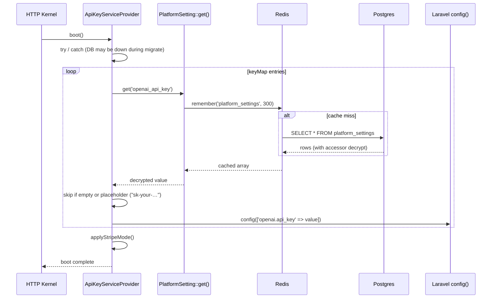

# Settings & Secrets

## TL;DR

Sambla ships a dynamic, admin-editable configuration layer on top of Laravel's
static `config/*.php` files. Platform operators can rotate API keys, swap
Stripe modes, or change SMTP credentials from `/admin/settings` without
redeploying, SSH, or touching `.env`.

The system is a single table (`platform_settings`) with **key**, **value**,
**type**, **group**, and **is_encrypted** columns. Secrets are transparently
encrypted at rest with `APP_KEY` (Laravel `Crypt`). A service provider
(`ApiKeyServiceProvider`) reads the table at boot and overrides the in-memory
Laravel `config()` tree so third-party SDKs (OpenAI, Stripe, Telnyx,
Symfony Mailer, etc.) pick up DB-sourced credentials with zero code changes.

Effective precedence: **platform_settings (DB) > .env > config default**.

Relevant files:

- Model: `app/Models/PlatformSetting.php`
- Create table: `database/migrations/2026_03_20_100000_create_platform_settings_table.php`
- Encrypt-at-rest upgrade: `database/migrations/2026_04_15_120000_encrypt_platform_setting_secrets.php`
- Runtime override: `app/Providers/ApiKeyServiceProvider.php` (registered in `bootstrap/providers.php`)
- Admin controller: `app/Http/Controllers/Admin/AdminSettingsController.php`
- Admin UI: `resources/views/admin/settings.blade.php`

## Architecture

```
┌────────────────────────────────────────────────────────────────┐
│  Request lifecycle                                             │
│                                                                │
│   .env  ──► config/*.php  ──► ApiKeyServiceProvider::boot()    │
│                                         │                      │
│                                         ▼                      │
│                            PlatformSetting::get(key)           │
│                                         │                      │
│                                         ▼                      │
│                          Cache::remember('platform_settings',  │
│                                 300, DB query)                 │
│                                         │                      │
│                                         ▼                      │
│                     Crypt::decryptString(…) if is_encrypted    │
│                                         │                      │
│                                         ▼                      │
│                          config()->set('openai.api_key', …)    │
│                                         │                      │
│                                         ▼                      │
│                       any SDK reading config() sees DB value   │
└────────────────────────────────────────────────────────────────┘
```

Rows live in Postgres. Sensitive rows are Laravel-encrypted (AES-256-CBC via
`APP_KEY`), so a DB dump alone does not expose credentials — the attacker
also needs `APP_KEY`. If `APP_KEY` is lost or rotated without re-encrypting,
every secret row becomes unrecoverable; treat `APP_KEY` as tier-1 secret.

## Sensitive suffixes that trigger auto-encryption

`PlatformSetting::set()` decides automatically, based on the **key name
suffix**, whether to encrypt:

```php
private const SENSITIVE_SUFFIXES = [
    '_secret_key',
    '_api_key',
    '_webhook_secret',
    '_password',
    '_secret',
    '_token',
];
```

Any key ending in one of those suffixes is encrypted before insert and
marked `is_encrypted = true`. The accessor `getValueAttribute()` transparently
decrypts on read. If the cipher fails (e.g. `APP_KEY` drift), the accessor
logs a warning and returns `null` instead of throwing — this is deliberate,
so a bad secret cannot take down the entire admin panel.

Naming convention: **always name new secret settings with one of the
suffixes above**. Example: `mailgun_api_key`, not `mailgun_key`.
Misnaming is the single most common source of plaintext secrets in DB.

## Cache layer

- Key: `platform_settings`
- Store: the default cache driver (Redis in production)
- TTL: **300 seconds (5 minutes)**
- Shape: `['key' => ['value' => decrypted, 'type' => 'string', 'group' => 'openai'], …]`

Cache is **invalidated on every write** via model `saved` / `deleted`
events. After an admin hits “Save” in `/admin/settings`, the next HTTP
request already sees the new value.

However, **long-lived processes do not re-read the cache on every key
access** — `ApiKeyServiceProvider` runs once per request on web, but queue
workers and the Reverb websocket are long-running PHP processes. See
Gotchas below.

## ApiKeyServiceProvider boot sequence



The `try/catch` wrapper is important: during fresh installs or `artisan
migrate` the `platform_settings` table may not yet exist. Silent skip lets
migrations run without a chicken-and-egg failure.

The `isPlaceholder()` guard prevents values like `sk-your-openai-api-key`
or `pk_live_your-key` (defaults in seeded `.env.example`) from clobbering
a real value from `.env`.

Mapped config keys include:

| Setting key             | Laravel config target(s)                          |
|-------------------------|---------------------------------------------------|
| `openai_api_key`        | `openai.api_key`                                  |
| `openai_organization`   | `openai.organization`                             |
| `anthropic_api_key`     | `services.anthropic.api_key`                      |
| `elevenlabs_api_key`    | `services.elevenlabs.api_key`                     |
| `telnyx_api_key`        | `services.telnyx.api_key`                         |
| `telnyx_connection_id`  | `services.telnyx.connection_id`                   |
| `telnyx_public_key`     | `services.telnyx.public_key`                      |
| `mail_host/port/…`      | `mail.mailers.smtp.*`, `mail.from.*`              |
| Stripe (see below)      | `cashier.*`, `services.stripe.*`, `stripe.api_key`|

## Stripe dual-mode

Stripe is special because we persist **two full sets of keys** (live + test)
and let the operator flip between them without losing either set.

```
stripe_mode = 'live' | 'test'     ← selector
stripe_public_key / stripe_secret_key / stripe_webhook_secret          (live)
stripe_test_public_key / stripe_test_secret_key / stripe_test_webhook_secret
```

`applyStripeMode()`:

1. Reads `stripe_mode` (default `live`).
2. Picks the live or test triplet.
3. If the chosen secret is empty or placeholder, **falls back to the
   other mode** so the app never boots with a half-configured Stripe
   (we have seen this cause Cashier 500s mid-checkout).
4. Pushes the chosen triplet into `cashier.*`, `services.stripe.*`,
   `stripe.api_key`, plus a bookkeeping key `cashier.active_mode` that
   billing code can introspect.

The Admin form enforces that the mode you're **saving** has all three
required fields either freshly entered or already present (see
`updateStripe()` validation loop).

## Admin form masking rule

**Never pre-fill secret inputs with their ciphertext or plaintext value.**

The controller enforces this before the Blade view runs:

```php
$value = $isSecret ? '' : $row->value;
$settings[$row->group][$row->key] = $value;
$settings[$row->group][$row->key . '__present'] = ! empty($row->getRawOriginal('value'));
```

Rules for any secret `<input type="password">` in `settings.blade.php`:

1. `value=""` always — never bind to a stored secret.
2. Use the `__present` boolean to render a “Stored ✓ / change by typing a
   new value” hint so the operator knows a value exists.
3. The update controllers **treat an empty submission as “keep existing”**
   for Stripe; other groups replace with empty (intentional — SMTP may be
   legitimately disabled by clearing credentials).
4. The `pluck('key','value')` shortcut is **banned** for secrets — it
   bypasses the accessor and exposes ciphertext. The controller comment
   calls this out explicitly. Always iterate model instances.

## Groups

Settings are foldered by `group` for UI tabs and `PlatformSetting::getGroup()`
lookups:

- **general** — platform name/URL, support email, maintenance mode,
  registration toggle, timezone, language
- **openai** — API key, organization, realtime model id, max tokens,
  temperature
- **telnyx** — API key, connection id, public key, webhook URL,
  `phone_number_monthly_cost_lei`
- **stripe** — mode, currency, live triplet, test triplet
- **tax** — VAT rates, reverse-charge flag, per-country overrides
  (added post-base-migration via `PlatformSetting::set`)
- **email** — mailer, host, port, username, password, encryption,
  from address, from name
- **security** — bcrypt rounds, session lifetime, API rate limit, max
  login attempts, password min length
- Plus **anthropic**, **elevenlabs**, **whatsapp**, **facebook**,
  **instagram**, **sentry** for integrations

Retrieve a whole group with `PlatformSetting::getGroup('stripe')` — returns
casted, decrypted values keyed by setting name.

## Gotchas

- **Queue workers and Reverb do NOT auto-refresh after a secret rotation.**
  They boot once, `ApiKeyServiceProvider` populates `config()`, and then
  the PHP process stays alive. Rotating `openai_api_key` in the UI fixes
  the web tier immediately but the queue keeps using the old key until
  restarted. Always run `php artisan queue:restart` (and restart the
  `reverb` container) after a rotation.
- **`php artisan config:cache` still works** — the cached config file
  captures `.env` values only, and `ApiKeyServiceProvider::boot()` runs
  *after* the cached config is loaded, so DB overrides still win. You
  do not need to disable config caching to use this system.
- **Cache invalidation is per-save.** If you edit rows directly in Postgres
  (migrations, seeders, tinker), you must manually `Cache::forget('platform_settings')`
  — the model events only fire for Eloquent writes.
- **`APP_KEY` rotation breaks every encrypted row.** Use
  `php artisan key:rotate` with a custom migration that re-encrypts, or
  plan a maintenance window where admins re-enter secrets via the UI.
- **Placeholder filter is string-prefix only.** If you set `openai_api_key`
  to literally `"your-key-here"` through the UI, it will be silently
  ignored at boot (looks like a placeholder). Use real or test keys.
- **`Cache::flush()` from the admin “Clear Cache” button wipes the
  platform_settings cache too** — first request after a flush pays a DB
  round-trip; harmless but worth knowing.

## Runbook

### Rotate the OpenAI API key

1. Log in as super-admin → `/admin/settings?tab=openai`.
2. Paste the new key into **API Key**; leave everything else untouched.
3. Click **Save**. The model `saved` event clears `platform_settings`
   cache; next web request reloads from DB.
4. Restart long-running workers so they pick up the new key:
   ```bash
   docker compose exec app php artisan queue:restart
   docker compose restart reverb
   ```
5. Verify with `php artisan tinker`: `config('openai.api_key')`.
6. Revoke the old key in the OpenAI dashboard only after a successful
   test call.

### Add a new secret setting (example: `mailgun_api_key`)

1. **Name it with a sensitive suffix** (`_api_key`) so auto-encryption
   fires.
2. Seed the row via a one-off migration or from the UI save path:
   ```php
   PlatformSetting::set('mailgun_api_key', '', 'string', 'email');
   ```
3. Map it in `ApiKeyServiceProvider::overrideFromSettings()`:
   ```php
   'mailgun_api_key' => ['services.mailgun.secret'],
   ```
4. Add a field to `AdminSettingsController::updateEmail()` (or a new
   group handler) with `validate()` and `PlatformSetting::set(...)`.
5. In `settings.blade.php`, render `<input type="password" value="">`
   plus a `__present` stored-indicator. Do **not** bind the stored value.
6. Deploy; rotate workers as in the OpenAI runbook.

### Migrate legacy plaintext rows

The `2026_04_15_120000_encrypt_platform_setting_secrets` migration does
this automatically, but for rows inserted after that migration into
platforms that were on older code:

1. Identify suspicious rows:
   ```sql
   SELECT key FROM platform_settings
   WHERE is_encrypted = false
     AND (key LIKE '%\_api\_key' OR key LIKE '%\_secret\_key'
          OR key LIKE '%\_password' OR key LIKE '%\_token'
          OR key LIKE '%\_webhook\_secret' OR key LIKE '%\_secret');
   ```
2. Re-save them through the model (triggers encryption):
   ```php
   PlatformSetting::all()->each(function ($s) {
       if (str_ends_with_sensitive($s->key) && ! $s->is_encrypted) {
           PlatformSetting::set($s->key, $s->value, $s->type, $s->group);
       }
   });
   ```
3. Confirm `is_encrypted = true` for all sensitive rows.
4. `Cache::forget('platform_settings')` and restart workers.

The `looksEncrypted()` helper in the encrypt migration is idempotent —
safe to re-run; it will not double-encrypt rows that are already
Laravel-encrypted ciphertext.
