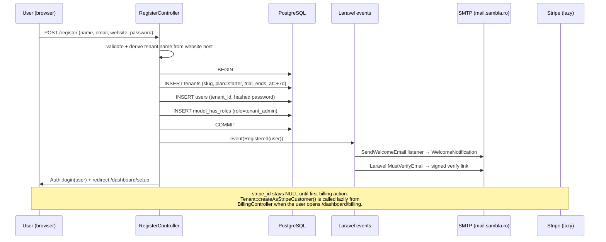

# Authentication & Authorization

## TL;DR

Sambla runs stock **Laravel 11 session auth** for the dashboard and **Sanctum personal access tokens** for the REST API. Registration is self-service: a single form creates `tenants` + `users` in one DB transaction, assigns the `tenant_admin` role (Spatie), fires the `Registered` event, and logs the user in. Password reset and email verification use Laravel defaults (signed URLs, tokenised reset, `MustVerifyEmail` contract) with modest throttling (`throttle:5,1` on reset-link, `throttle:6,1` on verify + resend). Authorization is role-based via **Spatie laravel-permission** with four role names — `super_admin`, `tenant_admin`, `tenant_manager`, `tenant_viewer` — plus a `TenantScope` global query scope for row-level isolation. Two policies exist (`BotPolicy`, `CallPolicy`) but **are never invoked** from controllers; role checks are inlined in middleware and `TenantScope` instead. Known gaps: no 2FA, Sanctum tokens are issued with wildcard `*` abilities, `admin_view_all` is session-scoped (not request-scoped), email verification is not yet gate-enforced on billing routes.

---

## Auth flow

Registration is the only public write path that creates tenants. It is a single POST to `/register` handled by `App\Http\Controllers\Auth\RegisterController::register`.



Key facts for reviewers:

- Tenant creation and user creation are wrapped in `DB::transaction` — a failure in role assignment rolls back the tenant row. The `Registered` event is dispatched **after** commit, so the welcome mail never fires for an orphaned user.
- The `website` field is required at registration and becomes the `tenants.name` (with `www.` stripped). There is no domain ownership check at this stage.
- Redirect target is always `/dashboard/setup`; the setup wizard then decides whether to push the user into the plan picker or the bot builder.
- `stripe_id` is populated on demand by Cashier (`createAsStripeCustomer()` in `BillingController`) and is reset to `null` if the stored ID is from a different Stripe mode (test vs live) — see the mode-reset block around `BillingController.php:257`.

---

## Password reset flow

Implemented by `PasswordResetController`, backed by Laravel's `Password` broker and the `password_reset_tokens` table.

1. `GET /forgot-password` — renders `auth.forgot-password`.
2. `POST /forgot-password` — `throttle:5,1` (5 requests/min/IP). Calls `Password::sendResetLink($email)` which generates a token, stores its SHA-256 hash, and queues the `ResetPassword` notification via the configured mailer (noreply@sambla.ro over STARTTLS:587).
3. `GET /reset-password/{token}?email=...` — renders the form; token and email are carried as hidden inputs.
4. `POST /reset-password` — validates `token`, `email`, `password` (min:8, confirmed). On success: `forceFill` the hashed password, regenerate `remember_token`, fire `PasswordReset` event, redirect to `/login`.

Security notes:

- Tokens are single-use and expire per `config/auth.php` → `passwords.users.expire` (default 60 min).
- The controller does not invalidate existing sessions after a reset. A reset is sufficient to log in from a new device but existing sessions on other devices persist until their own cookies expire. This is a known tradeoff — Laravel's default behaviour.
- Rate limit is **per IP**, not per email. Enumeration is mitigated by Laravel always returning the same generic status for "no such email" and "link sent".

---

## Email verification

`User` implements `Illuminate\Contracts\Auth\MustVerifyEmail`. On `Registered`, Laravel's built-in listener sends the `VerifyEmail` notification — a signed URL pointing at `verification.verify`.

Routes (all under `auth` middleware):

| Route | Handler | Middleware |
|---|---|---|
| `GET /email/verify` | `EmailVerificationController@notice` | `auth` |
| `GET /email/verify/{id}/{hash}` | `EmailVerificationController@verify` | `auth, signed, throttle:6,1` |
| `POST /email/verification-notification` | `EmailVerificationController@resend` | `auth, throttle:6,1` |

The `verify` action uses Laravel's `EmailVerificationRequest` form request, which validates the signed URL, the hash (sha1 of the email), and the user ID before hitting the controller. On success it stamps `users.email_verified_at` and fires `Verified`.

**Honest note**: the `verified` middleware is **not** currently applied to dashboard or billing routes (see `docs/PRODUCT_AUDIT.md` G19). A tenant admin can run the product during the 7-day trial without ever clicking the verification link. Re-enabling this before the first paid plan is on the roadmap.

---

## Sanctum API tokens

Tokens are minted from the user settings screen via `SettingsController::generateApiKey()`:

```php
$token = $user->createToken(
    $request->get('name', 'API Key'),
    $request->get('scopes', ['*'])   // <-- wildcard default
);
```

The plaintext token is shown once in a flash message and not persisted in readable form afterwards. Revocation goes through `revokeApiKey` which deletes the matching `personal_access_tokens` row.

**Scoping caveats (from `PRODUCT_AUDIT.md` G3, P0):**

1. Default abilities are `['*']` — a leaked token has tenant-wide control including billing and team management.
2. The token-generation endpoint itself has **no rate limit** and **no audit log entry** beyond Laravel's default logs. A compromised session can mint tokens silently.
3. Sanctum abilities are declared but **no API controller currently calls `$request->user()->tokenCan(...)`** — abilities are metadata only until that happens. Until abilities are actually checked, scoping a token down to e.g. `bots.read` provides no extra protection vs. `*`.

Mitigation plan tracked in roadmap: mandatory ability picker in the UI, `throttle:3,60` on `/dashboard/settings/api-keys`, and an observer that writes to `audit_logs` on `PersonalAccessToken::created|deleted`.

---

## Roles & permissions

Managed by **spatie/laravel-permission**. Role names use **underscores**, not dashes — this matters because `isAdmin()` / `hasRole()` do exact string matching. Roles and permissions are seeded by `database/seeders/RolePermissionSeeder.php`:

| Role | Scope | Permissions |
|---|---|---|
| `super_admin` | Platform | All ten permissions including `billing.manage`, `team.manage`, `settings.manage` |
| `tenant_admin` | Tenant | Everything except platform-wide ops (same list as super_admin but scoped via `TenantScope`) |
| `tenant_manager` | Tenant | `bots.{create,edit,view}`, `calls.view`, `analytics.view`, `team.manage` (no delete, no billing) |
| `tenant_viewer` | Tenant | Read-only: `bots.view`, `calls.view`, `analytics.view` |

Permissions list (as of `RolePermissionSeeder`): `bots.create`, `bots.edit`, `bots.delete`, `bots.view`, `calls.view`, `calls.delete`, `analytics.view`, `billing.manage`, `team.manage`, `settings.manage`.

Middleware wiring:

- `TenantAccess` (`app/Http/Middleware/TenantAccess.php`) — runs on all dashboard routes. Requires `auth()->check()`, then either `tenant_id` set OR `super_admin` role. This is the only gate that keeps super-admins without a tenant on the admin console.
- `EnsureSuperAdmin` (`app/Http/Middleware/EnsureSuperAdmin.php`) — protects `/admin/*`. Exact match on `hasRole('super_admin')`.

Row-level isolation is enforced by `App\Models\Scopes\TenantScope` applied globally to all tenant-scoped Eloquent models. It re-reads the role on every query so a role revocation takes effect immediately (no stale-session bypass).

---

## Policies: defined vs actually invoked

Two policy classes exist: `BotPolicy` and `CallPolicy`. They are **correctly written** (tenant_id equality + role checks) but a repo-wide grep for `authorize(` and `->can(` in `app/Http/Controllers` returns **zero matches**.

What this means in practice:

- `BotPolicy::update()`, `delete()`, `create()` are dead code today. Deletion protection for `tenant_viewer` is achieved only because controllers don't expose destroy routes to that role — not because the policy fires.
- Role gating currently lives **inline** in controllers (ad-hoc `$user->hasRole('tenant_admin')`) or at the **query** layer (`TenantScope`). This works for tenant isolation but leaves intra-tenant privilege escalation (viewer editing a bot) defended only by the absence of a UI button.
- The roadmap item is to wire `authorizeResource(Bot::class, 'bot')` into `BotController` and `CallController`, which costs ~5 lines per controller and shifts the check from "we didn't render the button" to "the framework rejected the request".

Treat the existing policy files as the **intended** authorization contract; the current **actual** contract is weaker.

---

## Google OAuth

Used **only** for per-tenant Google Drive connection (knowledge-base source), not for user sign-in. `GoogleOAuthController` implements a standard three-leg flow:

1. `GET /oauth/google/connect` — generates a CSRF `state`, stores it in session, stores `return_to`, redirects to Google's consent screen.
2. `GET /oauth/google/callback?code=&state=` — `hash_equals` check on state (timing-safe), swaps code for tokens via `GoogleOAuthService::handleCallback`, persists a `google_oauth_tokens` row keyed on `tenant_id`, and best-effort creates the KB folder on first connect.
3. `POST /oauth/google/disconnect` — revokes at Google and deletes the local token row.

All three routes sit behind `auth` middleware; there is no separate "sign in with Google" path for end users.

---

## 2FA

**Not implemented.** This is a known gap tracked in the roadmap. Candidate approaches:

- `laravel/fortify` TOTP (cheapest; requires session auth hook).
- WebAuthn via `web-auth/webauthn-lib` (future, enterprise-grade).

Until 2FA lands, super-admin accounts should use long unique passwords and the login endpoint should gain per-email throttling (currently only CSRF + session regeneration on success).

---

## Gotchas

1. **Role name mismatch (fixed today)** — `User::isAdmin()` still returns `$this->hasRole('admin')` but seeded role is `tenant_admin`. This method is effectively dead code; do not use it. Use `hasRole('tenant_admin')` or `isSuperAdmin()` directly. Controllers and policies already use the correct underscore names.
2. **`admin_view_all` is session-scoped** (`DashboardController@toggleViewAll` writes `session(['admin_view_all' => ...])`). Audit G18 flags this as a finding: a super-admin who toggles "view all" then walks away leaves the flag active for the session lifetime. Hardening: move to a signed, request-scoped query parameter so every cross-tenant read is explicit in logs.
3. **`TenantScope` double-checks the role** on every query (`session(...) && isSuperAdmin() && hasRole('super_admin')`) so demoting a user takes effect instantly even with a stale session flag — but the session still carries the boolean until logout, so logs may show `admin_view_all=1` for demoted users.
4. **Email verification not enforced** — `verified` middleware is absent from dashboard/billing. Users can trial-run without verifying. Reactivation is a one-liner but deferred until trial-conversion friction is measured.
5. **Sanctum `*` default** — covered above; treat any exposed API token as a full tenant compromise.

---

## Runbook

### Create a super_admin

```bash
php artisan tinker
>>> $u = App\Models\User::where('email', 'ops@sambla.ro')->firstOrFail();
>>> $u->assignRole('super_admin');
>>> $u->tenant_id = null;   // super_admins don't need a tenant
>>> $u->save();
```

If the role doesn't exist yet: `php artisan db:seed --class=RolePermissionSeeder`.

### Reset a user's password via CLI

```bash
php artisan tinker
>>> $u = App\Models\User::where('email', 'foo@bar.com')->firstOrFail();
>>> $u->forceFill(['password' => Hash::make('TempPass!2026')])->save();
>>> $u->tokens()->delete();   // nuke any API tokens they had
>>> DB::table('sessions')->where('user_id', $u->id)->delete();  // kill active sessions
```

To send a self-serve reset instead (preferred — no plaintext password handled by staff):

```bash
php artisan tinker
>>> Password::sendResetLink(['email' => 'foo@bar.com']);
```

### Issue an API token

UI path: `/dashboard/settings` → API Keys → name the token → submit. The plaintext is shown once in the flash banner. Revoke via the same page.

CLI (for scripting / backfill):

```bash
php artisan tinker
>>> $u = App\Models\User::where('email', 'foo@bar.com')->firstOrFail();
>>> $t = $u->createToken('integration-backfill', ['*']);
>>> echo $t->plainTextToken;   // store in secret manager, this is the only time
```

To revoke: `$u->tokens()->where('name', 'integration-backfill')->delete();`
