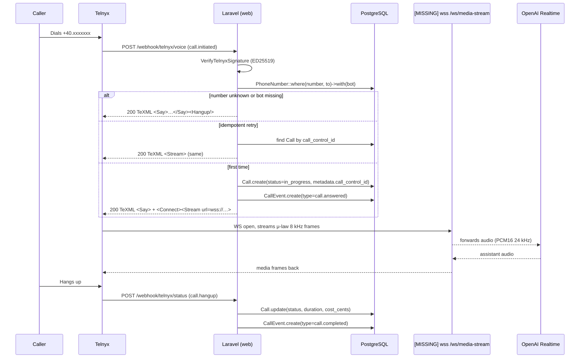

# Voice — Telnyx Integration

## TL;DR

Sambla uses Telnyx as the telephony provider for both inbound and outbound voice
calls. Inbound traffic lands at `POST /webhook/telnyx/voice`, the controller
resolves the dialed number to a `PhoneNumber` → `Bot`, creates a `Call` row,
and returns TeXML that tells Telnyx to `<Connect><Stream>` the audio to
`wss://{host}/ws/media-stream`. Status events land at
`/webhook/telnyx/status` and drive a state machine on the `Call` row.
Number provisioning goes through `TelnyxService::purchaseNumber()` and is
activated asynchronously by `number_order.*` webhooks. All three webhook
routes are guarded by `VerifyTelnyxSignature` (ED25519 via libsodium).

Cost model: **20¢/min** for standard OpenAI voices, **27¢/min** for
ElevenLabs cloned voices. Computed once on `call.hangup` and stored in
`calls.cost_cents`.

**Critical gap**: the `wss://{host}/ws/media-stream` WebSocket server is
not implemented in this repository. `MediaStreamHandler` exists to parse
Telnyx Media Stream frames and bridge them to the OpenAI Realtime session,
but no process currently listens on that URL. Inbound calls today play
the `<Say>` greeting, reach `<Connect><Stream>` and then fail to
establish audio. See the honest-note section below.

Relevant files:

- `app/Services/TelnyxService.php`
- `app/Http/Controllers/Webhook/TelnyxWebhookController.php`
- `app/Http/Middleware/VerifyTelnyxSignature.php`
- `app/Models/PhoneNumber.php`, `app/Models/Call.php`, `app/Models/CallEvent.php`
- `app/Services/MediaStreamHandler.php` (stub consumer; no server attached)
- `routes/web.php` (lines 485–493)

## Inbound call flow



The `<Connect><Stream>` XML is built by
`TelnyxService::generateMediaStreamTexml($botId, $callId)` and injects
two `<Parameter>` tags (`bot_id`, `call_id`) so the WS server can load
the right context when the stream opens.

## Outbound calls

Outbound is kicked off via `TelnyxService::makeCall(string $to, string $from, string $webhookUrl)`:

- Both `$to` and `$from` are validated against a strict E.164 regex
  `^\+[1-9]\d{7,14}$`. Any other format throws
  `InvalidArgumentException` before the HTTP call is made.
- Posts to `POST https://api.telnyx.com/v2/calls` with the configured
  `connection_id`, `to`, `from`, and `webhook_url` (method forced to
  `POST`).
- Returns the Telnyx `data` object (contains `call_control_id`,
  `call_leg_id`, `call_session_id`). Callers are expected to persist
  these on the originating `Call` record so the status webhook can
  match them later via the same `metadata->telnyx_call_control_id`
  lookup used for inbound.
- Auth headers are set by `TelnyxService::request()`:
  `Authorization: Bearer <apiKey>` where `apiKey` is loaded from
  `PlatformSetting('telnyx_api_key')` first and `config('services.telnyx.api_key')` as fallback.

There is no `makeCall` entry point wired into a UI yet; it is exercised
from jobs (daily batch outbound campaigns) and ad-hoc controllers.

## Signature verification

Telnyx signs every webhook with **ED25519**. The middleware
`App\Http\Middleware\VerifyTelnyxSignature` (alias `telnyx.verify`)
enforces verification on every request to `/webhook/telnyx/*`.

Algorithm:

1. In `local` or `testing` environments, verification is skipped — useful
   for `artisan tinker` replay but **never** enable those env names in
   production.
2. Load the public key from `PlatformSetting('telnyx_public_key')`
   (DB-first so it can be rotated without redeploy) or
   `config('services.telnyx.public_key')` as fallback. Missing key →
   `403`.
3. Read headers `telnyx-signature-ed25519` (base64) and
   `telnyx-timestamp` (unix seconds). Either missing → `403`.
4. Build the canonical signed payload:
   `"{timestamp}|{raw body}"` — note the `|` separator and the raw,
   unparsed body (`$request->getContent()`). Any middleware that
   consumes the body before this point will break verification.
5. `sodium_crypto_sign_verify_detached(decodedSig, signedPayload, decodedPubKey)`.
   Any `SodiumException` is caught and logged, then rejected.

**Replay protection**: the timestamp is *not* currently compared to
`now()` for a freshness window. Telnyx documents a 5-minute tolerance
as best practice; this is a known gap and should be added alongside a
Redis-backed nonce cache keyed by `call_control_id + event_type` if
stricter replay hardening is required. Today, idempotency at the
application layer (see Gotchas) prevents double-processing.

## Call state machine

`TelnyxWebhookController::VALID_STATUS_TRANSITIONS` is the authoritative
table:

| From          | Allowed next                                                     |
|---------------|------------------------------------------------------------------|
| `initiated`   | `ringing`, `in_progress`, `failed`, `canceled`                   |
| `ringing`     | `in_progress`, `completed`, `failed`, `busy`, `no_answer`, `canceled` |
| `in_progress` | `completed`, `failed`                                            |
| `completed`   | *(terminal)*                                                     |
| `failed`      | *(terminal)*                                                     |
| `busy`        | *(terminal)*                                                     |
| `no_answer`   | *(terminal)*                                                     |
| `canceled`    | *(terminal)*                                                     |

Telnyx event-type → internal status mapping:

- `call.initiated` → `initiated`
- `call.answered` → `in_progress`
- `call.hangup` → derived from `hangup_cause`:
  - `normal_clearing` / `normal_unspecified` → `completed`
  - `user_busy` → `busy`
  - `no_answer` / `no_user_response` → `no_answer`
  - `call_rejected` → `canceled`
  - everything else → `failed`
- `call.machine.detection.ended` (AMD) → recorded as a `CallEvent` but
  does **not** change `Call.status`.

Invalid transitions (e.g. a late `call.initiated` after `completed`) are
logged at `warning` and the webhook is still answered `200` so Telnyx
stops retrying. Same-status retransmissions are silently swallowed.

Every status change also inserts a `CallEvent` row with the raw
hangup cause and event type for audit.

## Number provisioning

Three-step flow:

1. **Search** — `TelnyxService::getAvailableNumbers(country='RO', type='local', limit=10)`
   hits `/available_phone_numbers` and returns `{number, friendly_name, capabilities{voice,sms}, region, monthly_cost}` tuples. Defaults to RO local DIDs; the admin UI can override.
2. **Purchase** — `TelnyxService::purchaseNumber($phoneNumber)` posts to
   `/number_orders` with the connection ID. Returns the raw Telnyx order
   object; the caller writes a `PhoneNumber` row with
   `status = PhoneNumber::STATUS_PENDING` and `telnyx_order_id = data.id`.
3. **Activate** — Telnyx fires `number_order.phone_number.enabled`
   (per-number) and `number_order.complete` (whole order) into
   `handleNumberOrder`. The controller flips
   `status → STATUS_ACTIVE` and `is_active → true` either by matching
   `phone_number` on the enabled event or by `telnyx_order_id` on the
   complete event. Uses `withoutGlobalScopes()` since the webhook has
   no tenant context.

`getNumberStatus($number)` and `getOrderStatus($orderId)` exist for UI
polling when the webhook hasn't arrived (or has been missed).
`releaseNumber($id)` issues a `DELETE /phone_numbers/{id}` and is used
when a tenant cancels or offboards.

## Call record fields

`calls` table (see `app/Models/Call.php`):

| Column                 | Source                                                    |
|------------------------|-----------------------------------------------------------|
| `tenant_id`            | `PhoneNumber.tenant_id` at dispatch time                  |
| `bot_id`               | `PhoneNumber.bot_id`                                      |
| `phone_number_id`      | FK to `phone_numbers`                                     |
| `caller_number`        | `payload.from` (inbound) or the provisioned DID (outbound) |
| `direction`            | `inbound` / `outbound`                                    |
| `status`               | state machine above                                       |
| `duration_seconds`     | `payload.duration_secs` on `call.hangup`                  |
| `cost_cents`           | `ceil(duration / 60 * costPerMin)`, min 1                 |
| `sentiment_score` / `sentiment_label` | post-call analyzer (separate pipeline)     |
| `recording_url`        | `payload.recording_urls[0]` if HTTPS-valid                |
| `summary`              | post-call LLM summary (separate pipeline)                 |
| `metadata`             | JSON blob, always contains `telnyx_call_control_id`, `telnyx_call_session_id`, `telnyx_call_leg_id` |
| `started_at` / `ended_at` | `now()` at creation / hangup                           |

`transcripts` and `call_events` are separate tables linked via
`call_id`. `CallEvent` stores every webhook + AMD signal for auditability.

Recording URL is validated: must pass `FILTER_VALIDATE_URL` and start
with `https://`. Anything else is logged and dropped — no insecure
URLs are persisted.

## Cost model

Executed inside `handleStatus()` when a call transitions to `completed`:

```php
$costPerMin = 20; // cents
if ($call->bot && $call->bot->usesClonedVoice()) {
    $costPerMin = 27;
}
$updateData['cost_cents'] = max(1, (int) ceil($duration / 60 * $costPerMin));
```

Notes:

- Cost is **minimum 1 cent** even for a 1-second call (Telnyx bills the
  call, we bill the minute).
- `ceil(duration/60 * rate)` rounds up, so a 61-second cloned-voice call
  costs `ceil(61/60 * 27) = ceil(27.45) = 28` cents.
- Only computed once: the guard `!$call->cost_cents` prevents
  double-billing on duplicate `call.hangup` webhooks.
- Non-completed terminal statuses (`busy`, `no_answer`, `canceled`,
  `failed`) currently cost **zero**. Telnyx does bill per-attempt
  carrier fees for some destinations — not yet modelled.
- The 20 / 27 split reflects OpenAI Realtime (gpt-4o-realtime) audio
  pricing vs. OpenAI + ElevenLabs cloned TTS. See
  `Bot::usesClonedVoice()` for the flag.

## HONEST NOTE: the WebSocket server is missing

`TelnyxService::generateMediaStreamTexml()` instructs Telnyx to dial
`wss://{app.url_host}/ws/media-stream`. **No process in this repository
listens on that URL.** `app/Services/MediaStreamHandler.php` is a
parser/translator that consumes Telnyx Media Stream JSON frames and
emits actions for a WS server to execute — but the WS server (Node
sidecar, Ratchet, Octane, etc.) is not built.

Consequences on a production call today:

1. Caller dials — Telnyx accepts, fires `call.initiated`.
2. Laravel returns TeXML with `<Say>Buna ziua…</Say>` and
   `<Connect><Stream url=wss://…>`.
3. Caller hears the Romanian greeting.
4. Telnyx attempts the WSS upgrade against `sambla.ro` — reverse proxy
   has no route, upgrade fails, stream never establishes.
5. Telnyx hangs up the leg; `call.hangup` arrives;
   status → `completed` with an unusually short duration.

Until the WS bridge is shipped, **inbound voice is effectively a demo
greeting**. Tracked in `ROADMAP.md`. Also note the bug:
`TelnyxWebhookController` calls `$this->telnyx->generateHangupTexml(...)`
in the error paths, but `generateHangupTexml()` is **not defined** on
`TelnyxService` — those error branches will throw `BadMethodCallException`
at runtime.

## Gotchas

- **Webhook idempotency**: Telnyx retries on non-2xx. We dedupe via
  `metadata->telnyx_call_control_id`. Tenant scope is explicitly
  applied on the inbound lookup (`Call::where('tenant_id', …)`) to
  prevent cross-tenant ID collision, but the status handler uses
  `withoutGlobalScopes()` because the webhook is unauthenticated — the
  `call_control_id` itself is a sufficient secret since it's unique per
  call. Never expose it to tenants.
- **Always return 200**: even on invalid state transitions, even when
  the phone number is unknown. Returning 4xx/5xx makes Telnyx retry
  indefinitely. The controller only returns 400 when the payload is
  malformed beyond recognition.
- **Raw body vs. parsed JSON**: signature verification requires the raw
  body. Do not add middleware that re-encodes the body
  (e.g. `TrimStrings`) *before* `VerifyTelnyxSignature` in the web
  group. Today the stack is safe because the verify middleware runs
  first on the dedicated route prefix.
- **Public key rotation**: DB-backed via `PlatformSetting` — update in
  Admin → Settings → Telnyx, no redeploy needed.
- **AMD events** come through as `call.machine.detection.ended` and
  produce a `CallEvent` but no status change. If you want AMD to
  disconnect a campaign call, that logic lives outside the webhook.
- **Local dev**: `app()->environment('local', 'testing')` short-circuits
  signature verification. If you run a staging with `APP_ENV=staging`,
  you **must** configure a real public key there.

## Runbook

### 1. Provision a number

```bash
php artisan tinker
>>> $t = app(App\Services\TelnyxService::class);
>>> $t->getAvailableNumbers('RO', 'local', 5);   // pick one
>>> $order = $t->purchaseNumber('+40312229988');
>>> App\Models\PhoneNumber::create([
...     'tenant_id' => 1,
...     'bot_id' => 42,
...     'number' => '+40312229988',
...     'provider' => 'telnyx',
...     'status' => App\Models\PhoneNumber::STATUS_PENDING,
...     'telnyx_order_id' => $order->id,
...     'is_active' => false,
... ]);
```

Wait for `number_order.phone_number.enabled` to arrive (usually < 60s).
Fallback: poll `TelnyxService::getNumberStatus($number)` and flip the
row manually.

### 2. Replay a webhook

Pull the raw body + headers from the Telnyx portal
(Mission Control → Debugging → Webhook Deliveries → Copy payload). Then:

```bash
curl -X POST https://sambla.ro/webhook/telnyx/status \
  -H 'Content-Type: application/json' \
  -H "telnyx-signature-ed25519: $SIG" \
  -H "telnyx-timestamp: $TS" \
  --data-raw "$BODY"
```

Headers and body must be byte-identical to the original — any
re-encoding breaks the signature. For local replay without the original
signature, temporarily set `APP_ENV=local` (the middleware skips there)
or copy the body into `php artisan tinker` and invoke the controller
method directly.

### 3. Debug a failed signature

Check `storage/logs/laravel.log` for
`VerifyTelnyxSignature: validation failed` — headers are logged but the
body is not. If you see it:

1. Confirm `PlatformSetting('telnyx_public_key')` matches the key shown
   in Telnyx → API Keys → Public Key (base64, 44 chars).
2. Confirm no middleware (e.g. a custom JSON rewriter) has mutated the
   request body. `php artisan route:list --path=webhook/telnyx`
   should show only `web` + `telnyx.verify`.
3. Confirm the timestamp header is present and numeric. Telnyx sends
   `telnyx-timestamp` as unix seconds.
4. Reproduce with `sodium_crypto_sign_verify_detached` in a REPL using
   the exact bytes from the offending log line to rule out a libsodium
   build issue.
5. If all else fails, rotate the key in Telnyx and re-paste into
   Admin → Settings → Telnyx.
