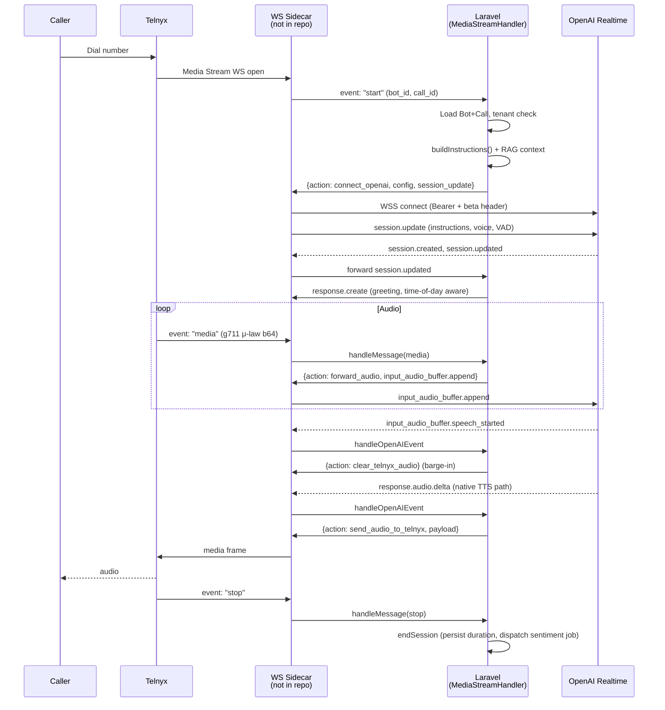

# Voice — OpenAI Realtime & Cloning

## TL;DR

Inbound/outbound calls on Sambla terminate on Telnyx, which opens a **Media
Stream WebSocket** toward a sidecar WS server. That server forwards Telnyx
frames to `MediaStreamHandler`, which **translates** them into action
descriptors: open an OpenAI Realtime connection, forward audio, synthesize
cloned-voice TTS, clear the queue on barge-in.

The Laravel application never speaks WebSockets directly — it is a pure
**state machine and event translator**. A Node/Ratchet sidecar (not in this
repo, see the HONEST NOTE below) owns the two live sockets (Telnyx ↔ OpenAI)
and obeys the descriptors `MediaStreamHandler` returns.

Inside the app the two core classes are:

- `RealtimeClient` — WebSocket config, session-update payload builder,
  exponential back-off, circuit breaker.
- `RealtimeSession` — tenant-isolated per-call object: builds the system
  prompt with RAG context, dispatches Realtime events, persists transcripts
  and call events, triggers filling messages when latency spikes, and
  extracts voice leads on `response.done`.

Voice cloning is an **ElevenLabs** integration. A tenant uploads a sample
via `ClonedVoiceController`, `ProcessVoiceCloning` job calls
`POST /v1/voices/add`, and when the resulting `elevenlabs_voice_id` is saved
the bot can be flipped to `ElevenLabsClonedTts`. In that mode OpenAI runs in
**text-only** modality and ElevenLabs handles the "voice".

## Session lifecycle



The whole dance is event-driven — there is **no long-running PHP process**.
Each Telnyx or OpenAI frame is a short HTTP-like request into the Laravel
container, processed synchronously, and the sidecar does the actual socket
juggling.

## RealtimeClient: URL + session config, circuit breaker

`app/Services/RealtimeClient.php` has three responsibilities.

**Connection config.** `getConnectionConfig()` returns the Realtime WSS URL
(`wss://api.openai.com/v1/realtime?model={model}`, default
`gpt-4o-realtime-preview`) plus the two required headers:
`Authorization: Bearer {OPENAI_API_KEY}` and `OpenAI-Beta: realtime=v1`.

**Session config builder.** `buildSessionConfig($options)` assembles the
`session.update` payload the sidecar sends immediately after the socket
opens. Fixed parts: `input_audio_format = output_audio_format = g711_ulaw`
(matches Telnyx natively, no resampling), `input_audio_transcription.model
= whisper-1`, `tool_choice = auto`. Overridable: `instructions`, `voice`,
`modalities` (see TTS strategy below), `turn_detection.type` +
`turn_detection.eagerness` (defaults `semantic_vad` + `low`),
`temperature` (0.7), `max_response_output_tokens` (1024), `tools`.

**Retries + circuit breaker.** `shouldRetry()`, `getRetryDelay()` (exp
backoff, 2^n × 1000 ms up to `maxRetries = 3`), `incrementRetry()`,
`resetRetries()`. Circuit breaker thresholds: **5 consecutive failures**
trip it; a **60-second** reset timeout allows a half-open probe.
`recordSuccess()` closes the breaker, `recordFailure()` opens it and logs
`RealtimeClient: circuit breaker OPEN after N consecutive failures`. The
breaker prevents retry storms when OpenAI is degraded.

## RealtimeSession: event handling

`app/Services/RealtimeSession.php` is constructed per call and **enforces
tenant isolation in its constructor** — if `$bot->tenant_id !==
$call->tenant_id` it throws `InvalidArgumentException`. This is the
second tenant check (the first is in `MediaStreamHandler::handleStart`) —
belt and suspenders, because one tenant speaking with another tenant's bot
would be a catastrophic data leak.

`handleEvent($event)` dispatches on event-type prefix:

- `session.*` → `handleSessionEvent`. On `session.created` the call is
  logged to `call_events.realtime.session_created`. On `session.updated`
  (if `pendingGreeting` is set) the method issues a `response.create` whose
  `instructions` tell the model to **speak the bot's greeting verbatim**,
  with the leading greeting rewritten to match time of day (`Bună
  dimineața` before 12:00, `Bună ziua` 12–18, `Bună seara` after).
- `input_audio_buffer.*` → `handleInputAudioEvent`. On `speech_started` a
  `speech.started` CallEvent is written; if a filling message was in flight,
  the pending context is preserved so the interrupted response doesn't lose
  the loaded data. Also pre-warms category/brand caches while the user is
  still speaking (predictive cache warming — the search is near-instant by
  the time the transcript arrives).
- `conversation.item.input_audio_transcription.completed` →
  `handleConversationEvent`. This is the hottest path: filter Whisper
  hallucinations (`WhisperHallucinationFilter`), persist user `Transcript`,
  then in parallel-ish:
  1. Follow-up detection from prior turn (`ConversationStateService`).
  2. `CategoryNavigationService::buildNavigationContext` — fast trigram DB
     lookup for brand/category hits.
  3. `ProductSearchService::search` — another trigram query, up to 5
     products with price + sale price.
  4. `OrderLookupService::detectOrderQuery` + WooCommerce API lookup for
     "where's my order" intents.
  5. `KnowledgeSearchService::buildContext` — the slow step; embedding
     query + pgvector similarity.

  If the cumulative wall-clock of 1–4 exceeds `early` threshold, or 1–5
  exceeds `late` threshold (both per-intent, from `FillingMessageService`),
  the method returns a **filling response** ("O clipă, verific…") and
  stashes the already-built context in `$pendingContext`. Otherwise it
  returns a `session.update` that replaces `instructions` with
  `buildInstructionsWithContext($context)`.
- `response.audio_transcript.done` → persist assistant transcript.
- `response.done` → write `response.completed` CallEvent, track token
  usage to `ai_api_metrics` (Realtime pricing: ~$0.06/1K input,
  ~$0.24/1K output), attempt voice-lead extraction, and if there is a
  pending context from a filling cycle, run the deferred knowledge search
  and emit **another** `response.create` so the model actually speaks the
  real answer after the filler (plain `session.update` does **not** trigger
  a response — this is a real gotcha).
- `error` → logged as `realtime.error` CallEvent.

## Instructions building with knowledge base context

`buildInstructions()` produces the *initial* system prompt for the session
and `buildInstructionsWithContext($ctx)` rebuilds it mid-call when the
context changes. Both follow the same skeleton:

1. `$bot->system_prompt` (or a Romanian default: "Ești un asistent vocal
   prietenos…").
2. If the bot has WooCommerce products (`hasProducts` is checked once in
   the constructor and cached), prepend an "INSTRUCȚIUNI PRODUSE" block
   that forces the model to quote real product names + prices.
3. `KnowledgeSearchService::buildContext($bot_id, $query, 4, 3500)` —
   capped at 3500 chars for the initial prompt, lean enough to fit the
   Realtime context window.
4. Popular products list (top 5 via `ProductSearchService`) for immediate
   availability without a search roundtrip.
5. `WooCommerceCategory::toChatContext($bot_id)` — full category tree for
   guided navigation.
6. Behavioural blocks: waiting messages, transcription-error ignore list
   (Whisper's common hallucinations like "subscribe", "mulțumim pentru
   vizionare"), order lookup instructions, lead-capture script.
7. `PromptGuardrails::apply($base, isVoice: true)` — centralised final
   pass.

`buildInstructionsWithContext` is a **trimmer** version used mid-call: it
omits the popular-products block and category tree (already in session
memory), keeps the guardrails, and injects the fresh `$knowledgeContext`
immediately under the product instructions. This is what gets pushed via
`session.update` every time the user says something new.

## MediaStreamHandler: action descriptors

`app/Services/MediaStreamHandler.php` **never speaks WebSockets directly**.
It returns arrays — "action descriptors" — that the sidecar interprets.
This split means the business logic is testable without sockets and the
sidecar is a thin dispatcher.

The descriptor vocabulary:

| Action                  | Emitted when                              | Sidecar must …                                              |
| ----------------------- | ----------------------------------------- | ----------------------------------------------------------- |
| `connect_openai`        | Telnyx `start` with valid bot/call        | Open WSS with `config.url`+`headers`, send `session_update` |
| `forward_audio`         | Telnyx `media` frame                      | Send `data` verbatim to OpenAI                              |
| `send_audio_to_telnyx`  | OpenAI `response.audio.delta` (native)    | Send Telnyx `media` frame with `payload`                    |
| `stream_audio_to_telnyx`| OpenAI `response.text.done` (cloned)      | Iterate `generator`, send each yielded frame                |
| `mark_stream`           | OpenAI `response.audio.done`              | Send Telnyx `mark` (timestamp)                              |
| `clear_telnyx_audio`    | OpenAI `input_audio_buffer.speech_started`| Send Telnyx `clear` (drop queued TTS — barge-in)            |
| `send_to_openai`        | Session produced a reply event            | Forward `data` to OpenAI                                    |
| `disconnect`            | Telnyx `stop`                             | Close both sockets                                          |

The `handleStart` method is where the **TTS strategy is selected**: if
`$bot->cloned_voice_id` is set and the linked `ClonedVoice` `isReady()`,
it builds `ElevenLabsClonedTts($voice->elevenlabs_voice_id)`; otherwise
`OpenAiNativeTts`. That strategy is passed into `RealtimeSession`, which
exposes it via `getTtsStrategy()`; `MediaStreamHandler` then uses
`shouldPassthroughAudio()` to decide between the two TTS paths.

## Voice cloning pipeline

Flow:

1. **Upload.** `ClonedVoiceController::store` (`POST
   /dashboard/bots/{bot}/voice-clone`) validates a `wav|mp3|webm|ogg`
   ≤20 MB, stores it under `voice-samples/{tenant_id}/…` on the local
   disk, creates a `ClonedVoice` row with `status = pending`, dispatches
   `ProcessVoiceCloning`.
2. **Job.** `app/Jobs/ProcessVoiceCloning.php` (`tries=2`, backoff
   `[30, 120]` s, `timeout=180` s, queue `default`). Flips status to
   `processing`, fires `VoiceCloningStatusChanged` (broadcast to
   dashboard), then calls `ElevenLabsService::createVoice($name,
   $audioPath)` which POSTs multipart to
   `https://api.elevenlabs.io/v1/voices/add`. On success stores
   `elevenlabs_voice_id`, flips status to `ready`; on failure writes an
   error message.
3. **Activation.** `ClonedVoiceController::activate` sets
   `bots.cloned_voice_id`. Every subsequent call picks it up in
   `MediaStreamHandler::handleStart`.
4. **Use.** On each assistant turn, `ElevenLabsClonedTts` receives the
   text from OpenAI (`response.text.done` or
   `response.audio_transcript.done`) and calls
   `ElevenLabsService::synthesize($voiceId, $text, 'ulaw_8000')`. The
   `ulaw_8000` output format is **the** reason this integration works —
   ElevenLabs returns audio already in Telnyx-native μ-law 8 kHz, so no
   resampling is needed on the way back.
5. **Deletion.** `destroy` clears `bots.cloned_voice_id`, calls
   `DELETE /v1/voices/{id}` on ElevenLabs, removes the local sample,
   deletes the row.

Costs are recorded on every ElevenLabs call into `ai_api_metrics`
(`provider = elevenlabs`, `model = voice-cloning` or `tts`, ~$0.10 per
clone, ~$0.30 / 1 000 chars for TTS).

## TTS strategy selection

The `TtsOutputStrategy` contract (`app/Contracts/TtsOutputStrategy.php`)
declares four methods: `getModalities()`, `shouldPassthroughAudio()`,
`supportsStreaming()`, `handleTextResponse()` / `handleTextResponseStreaming()`.

**`OpenAiNativeTts`** — modalities `['text','audio']`, passthrough `true`,
streaming `false`. `handleTextResponse` returns `null` because the audio
comes as `response.audio.delta` frames and `MediaStreamHandler` forwards
those directly.

**`ElevenLabsClonedTts`** — modalities `['text']` (OpenAI produces **text
only**, no audio tokens billed), passthrough `false`, streaming `true`.
`handleTextResponseStreaming($text, $streamSid)` is a PHP generator that
splits text on `(?<=[.!?])\s+` boundaries, merges fragments shorter than
20 chars, and yields a `send_audio_to_telnyx` descriptor for each synthesized
chunk. This gives fast time-to-first-audio — the first sentence plays while
the rest is still synthesizing. If the first chunk fails it falls back to
single-shot `handleTextResponse` (non-streaming synthesis of the whole text).

## HONEST NOTE

**The WebSocket server that consumes these action descriptors is not in
this codebase.** `MediaStreamHandler` and `RealtimeSession` are pure event
translators; they return descriptors but have no code that opens a WSS
connection to OpenAI or back to Telnyx. Running this in production needs
a **sidecar** (Node.js with `ws`, or PHP with Ratchet/ReactPHP) that:

1. Accepts the Telnyx Media Stream inbound WS.
2. Calls the Laravel app (HTTP or process-internal) for each Telnyx
   message; acts on the returned descriptor.
3. Opens the OpenAI Realtime WSS when told to, streams frames back and
   forth; calls the Laravel app for each OpenAI event; acts on the
   returned descriptor.

Building that sidecar is on the roadmap. Until it lands, Realtime calls
through Telnyx will not complete end-to-end — the descriptors are produced
but no process consumes them. The existing API route
`/v1/bots/{bot}/realtime-session` (see `RealtimeSessionController`) is for
the **browser WebRTC** path which bypasses Telnyx entirely and is
unaffected.

## Gotchas

- **μ-law 8 kHz ↔ PCM 24 kHz.** OpenAI Realtime natively supports
  `g711_ulaw`, which is what Telnyx sends. We set both `input_audio_format`
  and `output_audio_format` to `g711_ulaw` and skip resampling entirely.
  ElevenLabs is asked for `ulaw_8000` for the same reason. Do **not**
  change these — switching to PCM 24 kHz requires a resampler in the
  sidecar and doubles CPU.
- **`session.update` does not trigger a response.** Only
  `response.create` does. This bites the filling-message flow: after the
  filler completes, `handleResponseEvent` must emit `response.create` with
  the updated instructions, not just `session.update`, or the user hears
  the filler and then silence.
- **Chunking in cloned-voice streaming.** Sentences shorter than 20 chars
  are merged into the next chunk to avoid choppy playback; trailing
  fragments are appended to the last full chunk. Tune in
  `ElevenLabsClonedTts::splitIntoChunks()`.
- **Reconnect.** `RealtimeClient` does retries on connect, but once the
  call's session is live a drop aborts the call — Telnyx is already
  streaming media and cannot be paused. The circuit breaker protects the
  platform, not the individual call.
- **Whisper hallucinations.** Silent audio regularly transcribes as
  "subscribe", "mulțumim pentru vizionare", "la revedere", etc. The
  instructions include an explicit ignore list **and**
  `WhisperHallucinationFilter::isHallucination` drops the transcript
  before it ever reaches the model. Without this, the bot happily answers
  ghost messages.
- **Cross-tenant safety.** Checked twice:
  `MediaStreamHandler::handleStart` and `RealtimeSession::__construct`.
  Both use `withoutGlobalScopes()` when loading Bot/Call (because the WS
  sidecar has no tenant context) and compare `tenant_id` manually.

## Runbook

**Test Realtime connection.** From inside the `app` container:
```bash
docker compose exec app php artisan tinker
>>> $c = new App\Services\RealtimeClient();
>>> $c->getConnectionConfig();
>>> $c->buildSessionConfig(['instructions' => 'ping']);
```
To test the actual socket, use `wscat` with the same headers — the app
itself does not hold the socket:
```bash
wscat -H "Authorization: Bearer $OPENAI_API_KEY" \
      -H "OpenAI-Beta: realtime=v1" \
      -c "wss://api.openai.com/v1/realtime?model=gpt-4o-realtime-preview"
```

**Debug audio gaps.** Query `call_events` for a call:
```sql
SELECT type, occurred_at, metadata
FROM call_events WHERE call_id = :id ORDER BY occurred_at;
```
Look for gaps between `speech.started` and `response.completed` larger
than 3 s — these correlate with slow knowledge searches. Cross-check
against `ai_api_metrics` for embedding latency. If gaps exceed
`FillingMessageService` thresholds but no filler was sent, the intent
detector returned a label whose threshold is `null`.

**Rotate OpenAI key.** Update `OPENAI_API_KEY` in Coolify env (not in the
repo), restart the `app`, `queue`, and any `reverb` containers. The
sidecar, when it exists, will need the same rotation. `RealtimeClient`
reads the key per-instantiation so no cache bust is needed inside PHP.

**Rotate ElevenLabs key.** Set `elevenlabs_api_key` in
`platform_settings` (falls back to `services.elevenlabs.api_key`). No
container restart needed — `ElevenLabsService::apiKey()` reads on every
call.
