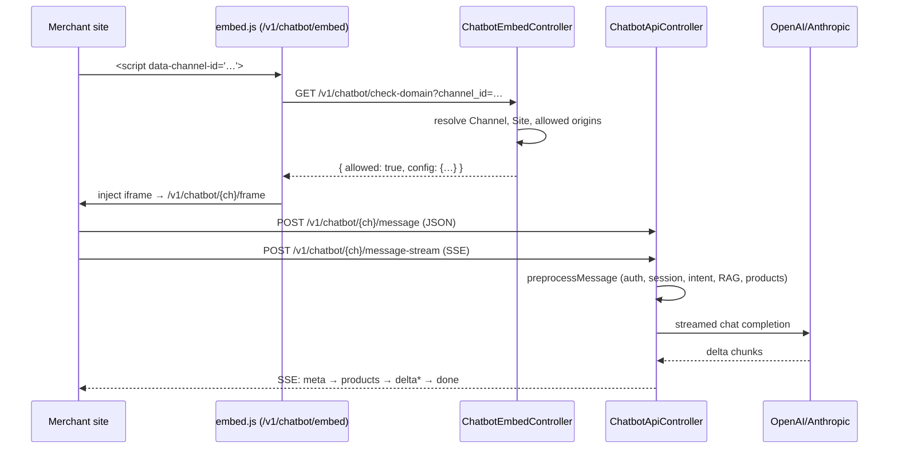

# Chat Widget & Messaging

## TL;DR

Sambla ships a JS-embeddable web chat widget (`public/widget/sambla-chat.js`,
~2400 lines) plus a simpler iframe-based embed (`resources/views/chatbot/embed-js.blade.php`
+ `frame.blade.php`). Both talk to a single god controller,
`App\Http\Controllers\Api\ChatbotApiController`, which handles config lookup,
domain-verified messaging (`message`, `messageStream`), product search,
feedback and per-conversation rating. Streaming uses SSE to dodge
Cloudflare's 60s edge timeout on long LLM replies (commit `4ca4853`). The
controller orchestrates intent detection, RAG (`KnowledgeSearchService`),
grounded product retrieval, A/B prompt/model/policy variants, a
post-response product-relevance gate that suppresses cards when the AI text
says "I don't know", automatic lead extraction, and V2 analytics events.
Channels of type `web_chatbot` are auto-provisioned during bot setup
(`SetupWizardController::store`), so a tenant with a verified `Site` can embed
the widget on their domain with a single `<script>` tag.

## Public embed flow



The verification path is enforced twice: once by `VerifyChatbotDomain`
middleware on messaging routes (compares request `Origin` against
`sites.domain` for the bot's tenant), and once by
`ChatbotEmbedController::checkDomain` via `Site::getAllowedOrigins()` before
the iframe is injected. Requests with no `Origin` (Postman, curl) are logged
but allowed.

## ChatbotApiController responsibilities — the god controller

Over 2000 lines in a single file. Public entry points:

- `config(channelId)` — lightweight JSON: bot name, greeting, color, language.
  Reads `channels.config` which is the source of truth for widget display
  (kept in sync with `bot.greeting_message` by commits `874f838`/`54847c8`).
- `message(channelId)` — classic non-streaming JSON endpoint. Returns the
  full reply plus `products` array in a single response.
- `messageStream(channelId)` — SSE variant for streamed deltas.
- `searchProducts(channelId)` — on-demand product card fetch.
- `feedback(channelId)` — thumbs up/down on a specific bot message (writes
  `RetrievalFeedback`).
- `rateConversation(channel)` — 1–5 star conversation rating
  (`ConversationRating`, `rating_source = 'widget'`).

Both `message` and `messageStream` delegate heavy lifting to shared private
helpers:

- `preprocessMessage()` — validates input, rate limits, resolves / rotates
  session tokens (HMAC over `session_id + channelId + app.key`, 10 minute
  idle expiry), creates or loads `Conversation`, writes the user `Message`,
  runs `ConversationFocusService`, `IntentOrchestratorService` (or legacy
  pipeline behind `bot.settings.legacy_pipeline`), builds product cards and
  extra prompt context. Returns a dictionary that both entry points consume.
- `generateAIResponse()` — non-streaming path: composes system prompt,
  injects knowledge context, policies, guardrails, calls
  `ChatCompletionService` via `ChatModelRouter`, logs via
  `ChatbotRequestLogger`.
- `buildPromptForStream()` — parallel builder used by the streaming path.

This controller is a god object in the classic sense: 11 private helpers
beyond the five public actions, inline Romanian system prompts (>40 lines of
product-card format rules), inline preg_match regexes for positive /
negative / clarification sentiment on the AI output, inline lead extraction,
inline A/B switch tables. The duplication between `message()` and
`messageStream()` is a known maintenance tax; both branches implement the
same product-relevance gate and the same persistence/analytics block
side-by-side. The streaming gate is weaker because SSE deltas cannot be
retracted once sent (see below).

## SSE streaming

Headers (`sseHeaders()`):

```
Content-Type: text/event-stream
Cache-Control: no-cache
X-Accel-Buffering: no     # disables nginx buffering
Connection: keep-alive
```

`sendSSE(type, data)` emits `data: {json}\n\n` and does an explicit
`ob_flush(); flush();` so each chunk hits the socket immediately. Event
types in order:

1. `meta` — session_id, session_token, conversation_id, session_expired.
2. `products` — product card array (sent BEFORE the text so the UI can
   render cards above the streaming answer).
3. `delta` — one or more content chunks from `OpenAI::chat()->createStreamed`
   or Anthropic `messages()->createStreamed`. For Anthropic, only
   `content_block_delta` events are forwarded.
4. `products` (second emit, possibly `[]`) — if the relevance gate decides
   to suppress cards after reading the final text.
5. `done` — carries the persisted `message_id` so the widget can bind
   feedback actions.
6. `error` — on any throw, a generic Romanian message.

## RAG + product retrieval integration

Two parallel retrieval layers feed the prompt:

- **Knowledge base** — `KnowledgeSearchService::buildContext(bot_id, query, limit)`
  runs pgvector + BM25 hybrid search against `bot_knowledge` / `knowledge_chunks`
  and returns a plain-text context block. Skipped when
  `IntentDetectionService::shouldSkipKnowledge()` returns true (greetings,
  thanks, pure small talk). Default `searchLimit` is 5, 8 if the bot has
  products.
- **Product cards** — `IntentOrchestratorService::execute()` (V2 pipeline)
  or the legacy `searchProductCards()` + `GroundedProductContextService`
  combo (when `bot.settings.legacy_pipeline`). Products are always injected
  both as structured cards (returned to the widget) and as a grounded text
  block in the system prompt, so the LLM quotes the exact names/prices it
  sees rather than inventing them.

`ConversationFocusService::augmentQuery()` rewrites follow-up queries using
the active topic so "pe ăla vreau să îl comand" resolves to the last
product — but only for product search; the LLM still sees the raw user
message.

## Product relevance gate

Implemented around line 128 in `message()` and line 1160 in `messageStream()`.
Ground truth is the AI text, because that's what the user sees. Three
regexes classify the response:

- **Positive** — "recomand", "sugerăm", "am găsit", "avem", "iată", "uite
  [câteva|produsele]", "în stoc", etc. Also matches grounded references
  where the AI said the first word of a retrieved product name.
- **Clarification** — "spune-mi ce tip cauți", "ce anume cauți", "pentru ce
  folosești", "ai vreo preferință", "ce buget".
- **Negative** — "nu am găsit", "n-am găsit", "nu dispun", "nu știu", "nu
  pot găsi", "momentan, nu am", "îmi pare rău, nu …", "indisponibil",
  "contactează magazinul".

Decision table (products present, `queryIntel.type` in
`[transactional, product_search, category_recommendation, comparison,
exploratory]` = "explicit product intent"):

| Text flag            | Explicit intent | Action                                   |
|----------------------|-----------------|------------------------------------------|
| Negative             | any             | `products = []` — always suppress cards |
| Clarification only   | any             | `products = []`                          |
| No positive mention  | no              | `products = []`                          |
| Explicit + reply <25c| yes             | rewrite text via `buildProductIntroText`|

A trailing list-announcement safety net then strips any orphan sentence
ending in `:` when `products` is empty, so the user never sees "Iată ce am
găsit:" followed by nothing.

In streaming mode the gate is weaker because deltas can't be unsent — the
controller can only emit a second `products: []` SSE event to tell the
widget to hide the already-delivered cards.

A deferred TODO (`bug2-confidence-gate`) tracks adding score-based
suppression once `ProductSearchService::search()` stops stripping per-card
relevance scores.

## Conversation + Message models, persistence

- `App\Models\Channel` — typed (`TYPE_WEB_CHATBOT = 'web_chatbot'`), has a
  `config` JSON column that stores greeting/color, plus `last_activity_at`.
- `App\Models\Conversation` — tenant-scoped (`BelongsToTenant`), holds
  `external_conversation_id` (the widget's session UUID),
  `messages_count`, `cost_cents`, `metadata` (user agent, origin,
  `last_product_context`, `last_product_cards`, TTL stamp). Closed
  conversations get `status = 'completed'` and dispatch
  `DeriveConversationOutcomes` 5 seconds later.
- `App\Models\Message` — `direction ∈ {inbound, outbound}`, `content_type`,
  `ai_model`, `ai_provider`, token/cost fields, `metadata.products`, plus
  V2 analytics columns `detected_intents`, `pipelines_executed`,
  `knowledge_chunks_used`.

The controller writes a greeting outbound message on conversation creation,
then one inbound for each user turn and one outbound per AI reply.
Increments `messages_count` on every write. `cost_cents` rolls up into the
conversation in non-streaming mode only (streaming doesn't expose token
counts on the OpenAI PHP SDK).

## A/B prompt variants

Two independent systems run side by side:

- `BotPromptVersion::selectForBot($botId)` — weighted-random pick per
  request inside `generateAIResponse()`. Simple prompt-only variants with
  `weight` integers.
- `AbTestingService::getVariantForConversation($botId, $convId)` — richer,
  conversation-sticky (assignment stored in `ab_assignments`), supports
  four variant types: `prompt`, `model`, `policy`, `rag_config`. The
  controller switches on `$abVariant['type']` and overrides `bot->system_prompt`,
  `bot->settings.model_override`, `bot->settings.policy_override`, or
  `bot->settings.rag_override` before the prompt is built. On each reply
  `AbTestingService::recordMetrics()` writes messages_count, has_products,
  lead_captured and response_time_ms.

## Channel auto-creation

`SetupWizardController::store()` (line 163-172) always appends a
`web_chatbot` channel to a newly created bot:

```php
$bot->channels()->create([
    'type' => 'web_chatbot',
    'name' => 'Web Chatbot',
    'is_active' => true,
    'config' => [
        'greeting' => $validated['greeting'],
        'color'    => '#991b1b',
    ],
]);
```

Commits `b0ffbb3` and `54872d2b` hardened this: the channel is also created
on bare `POST /bots` when missing, and `bot.greeting_message` updates
propagate into `channels.config.greeting` (`874f838`). The widget's greeting
therefore always matches whatever the operator sees in the bot editor.

## Rate limits + domain verification

- `VerifyChatbotDomain` middleware (`app/Http/Middleware/VerifyChatbotDomain.php`)
  — resolves `Channel` → `Bot` → `tenant_id`, looks up `sites` where
  `status = active AND verified_at IS NOT NULL` matching the request
  `Origin` (case-insensitive, `www.` stripped). 403s with `Domain not
  authorized` on mismatch. Adds `Access-Control-Allow-Origin: <origin>` and
  credentials headers on success. No Origin → allowed but logged
  (`domain_verified = false`).
- Per-IP-per-channel message limit: 30 / 60 seconds (`chatbot:msg:{ip}:{ch}`).
- Per-IP product search limit: 20 / 60 seconds.
- Per-IP domain check limit: 60 / 60 seconds.
- Per-channel feedback: Laravel `throttle:30,1`.
- Per-channel conversation rating: `throttle:10,1`.
- Tenant-level message budget enforced by `PlanLimitService::canSendMessage`
  (429 with `limit_reached: true`). Bypassed for test-mode bots/tenants.

## Gotchas

- **PHP-FPM + long-lived SSE.** `sendSSE` calls `ob_flush()` + `flush()`
  after every delta, but `X-Accel-Buffering: no` is critical — without it
  nginx holds the entire response. `output_buffering` in php.ini must also
  be off (or `ob_end_flush()` at the top); otherwise chunks sit in PHP's
  buffer until FPM closes the worker.
- **60-second edge timeout (`4ca4853`).** Cloudflare and Traefik both cut
  idle-ish HTTP/1.1 responses at 60s. `message()` returns a single JSON
  body, so LLM replies over ~60s showed as "Eroare de conexiune" in the
  widget. `frame.blade.php` now POSTs to `/message-stream` and renders
  deltas incrementally. The first `meta` event flushes within ~200ms,
  resetting the idle counter; subsequent deltas keep the connection warm.
- **Products-before-text ordering.** Cards are emitted before any `delta`
  so the UI is never empty. If the gate later decides to hide them, a
  second `products: []` event is sent — the widget must treat the most
  recent `products` event as authoritative.
- **CORS.** Handled by `VerifyChatbotDomain` on message endpoints and by
  `ChatbotEmbedController::checkDomain` on the embed endpoint. Preflight
  OPTIONS is handled by Laravel's default cors middleware; the widget
  always sends `Content-Type: application/json`, `Accept: text/event-stream`
  for SSE.
- **Session token rotation on idle.** 10 minutes of silence closes the
  conversation, dispatches outcome derivation, and forces the widget to
  start a new session on its next message. The controller surfaces this as
  `session_expired: true` so the widget can clear local history.

## Runbook

### Embed on a new domain

1. Verify the tenant's `Site` row: `domain` set, `status = active`,
   `verified_at` not null. Use the tenant dashboard's site verification
   flow (DNS TXT or meta tag) if missing.
2. Confirm the bot has a `web_chatbot` channel:
   `SELECT id, is_active, config FROM channels WHERE bot_id = ? AND type = 'web_chatbot';`
   If missing (old bots), create it via `SetupWizardController::store` or
   manually with `greeting` + `color`.
3. Paste the snippet from the bot settings page:
   ```html
   <script src="https://sambla.ro/v1/chatbot/embed" data-channel-id="{channel_id}" async></script>
   ```
4. Load the page and check DevTools Network for
   `GET /v1/chatbot/check-domain` returning `allowed: true`. If 403, the
   Site.domain / Origin mismatch is almost always the cause — check `www.`
   stripping and https vs http.

### Debug a conversation

1. Resolve by `external_conversation_id` (the widget's session UUID, also
   returned as `session_id` in every response):
   `SELECT * FROM conversations WHERE external_conversation_id = ?;`.
2. Pull messages ordered by `id`; `direction = outbound` rows carry
   `ai_model`, `ai_provider`, token counts, `detected_intents`, and
   `metadata.products` for what the widget actually rendered.
3. Check `storage/logs/laravel-*.log` for
   `ChatbotRequestLogger` entries (keyed by `bot_id`, `conversation_id`)
   and for `Orchestrator failed, falling back to legacy` warnings.
4. `conversation_events` (V2 analytics) contains
   `session_started`/`message_sent`/`message_replied`/`products_returned`/
   `lead_completed` with idempotency keys — useful to reconstruct the
   timeline without ambiguity.

### Tweak a prompt

- Short-term: edit `bots.system_prompt` directly; effect is immediate on
  next request (but cached 10 minutes per-bot in
  `bot_system_prompt_{bot_id}` — `php artisan cache:forget` if urgent).
- A/B: add a `BotPromptVersion` with `is_active = true` and a `weight`. The
  controller will weighted-sample per request. Good for low-risk prompt
  tweaks.
- Experimental: create an `AbExperiment` with `type = 'prompt'`, `status =
  'running'`, and variants `[{id,config:{system_prompt,...},weight}]`.
  Assignments are sticky per conversation, so a single user sees consistent
  behavior across turns, and `AbTestingService::recordMetrics` captures
  lead/response_time outcomes for analysis.
