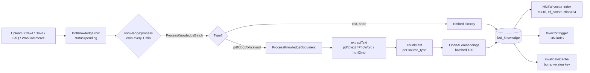

# Knowledge Base & RAG

## TL;DR

Sambla's RAG stack is PostgreSQL-native. Documents (uploads, web crawls, Google Drive files, FAQs, WooCommerce product feeds) are chunked per source type, embedded with OpenAI `text-embedding-3-small` (1536 dims), and stored in `bot_knowledge` with a `pgvector` column indexed via HNSW (m=16, ef_construction=64) plus a stored `tsvector` column indexed via GIN. Retrieval is hybrid: vector cosine similarity and full-text `ts_rank_cd` are merged with Reciprocal Rank Fusion, deduplicated per source title, optionally LLM-reranked in an "uncertain zone" (similarity 0.58–0.85), and enriched with adjacent sibling chunks (±1 chunk_index). Context is budgeted to 6000–8000 characters. Scoping is by `bot_id` only — there is no `tenant_id` column on `bot_knowledge`, so isolation depends on every query filtering by `bot_id`.

Primary code:

- `/var/www/voicebot-saas/app/Services/KnowledgeSearchService.php` — hybrid search, context builder, rerank, cache
- `/var/www/voicebot-saas/app/Jobs/ProcessKnowledgeDocument.php` — per-document chunk + embed pipeline
- `/var/www/voicebot-saas/app/Jobs/ProcessKnowledgeBatch.php` — bot-scoped batch processor (fast path for short text)
- `/var/www/voicebot-saas/app/Jobs/CrawlWebsite.php` — BFS crawler with robots.txt, SSRF guard, SHA-256 dedup
- `/var/www/voicebot-saas/app/Jobs/ImportGoogleDriveFile.php` — Drive connector ingest
- `/var/www/voicebot-saas/app/Console/Commands/ProcessKnowledge.php` — `knowledge:process` scheduled command
- `/var/www/voicebot-saas/config/knowledge.php` — all tunables
- `/var/www/voicebot-saas/database/migrations/2024_01_01_000010_enable_pgvector_extension.php`
- `/var/www/voicebot-saas/database/migrations/2024_01_01_000050_create_bot_knowledge_table.php`
- `/var/www/voicebot-saas/database/migrations/2026_03_29_100000_upgrade_knowledge_indexes.php`
- `/var/www/voicebot-saas/database/migrations/2026_04_01_100000_rag_improvements.php`

## Ingestion pipeline



The scheduler (`routes/console.php`) runs `knowledge:process --batch=100 --max-batches=5` every minute with `withoutOverlapping()`. The command applies backpressure (skips if `queues:knowledge` > 500 jobs), locates bots with pending rows, and dispatches `ProcessKnowledgeBatch` jobs onto the dedicated `knowledge` queue. Per-bot concurrency is prevented via a 60-second `Cache::lock("knowledge_batch_processing_{botId}")`.

## Chunking rules

Configured at `config/knowledge.php` → `chunking` (max tokens) and `chunk_overlap` (ratio):

| source_type | chunk size (tokens) | overlap ratio | rationale |
|---|---|---|---|
| `faq` | 128 | **0%** | Q&A pairs are self-contained; overlap would contaminate retrieval |
| `manual` | 256 | 10% | Structured docs with moderate continuity |
| `scan` | 384 | **15%** | Web pages: highest overlap because paragraphs flow |
| `upload` | 512 | **12.5%** | PDFs/DOCX: balanced overlap |
| `connector` | 512 | 10% | Drive imports, WooCommerce products |
| `agent` | 512 | 10% | Knowledge agent–generated content |

`ProcessKnowledgeDocument::chunkText()` splits on paragraph boundaries first, then builds chunks respecting `maxTokens`. If a single paragraph exceeds the limit, it falls back to word-level splitting. Token counts come from `TokenizerService` (tiktoken). Overlap is `max(32, chunkSize * overlapRatio)` tokens carried from the tail of the previous chunk.

Post-chunking quality filter drops chunks below 50 chars or 5 words (20 chars / 3 words for FAQ). If every chunk is filtered, the raw text is kept as a single chunk rather than losing the document.

## Embedding: OpenAI text-embedding-3-small

- Model: `text-embedding-3-small`, **1536 dimensions** (fixed — the `bot_knowledge.embedding` column is typed `vector(1536)`)
- Batching: chunks are sent in groups of **100** per API call (`generateEmbeddingsBatch()`)
- Cost tracked: every batch writes an `AiApiMetric` row (`cost_cents = tokens * 0.000002`, i.e. $0.02/1M tokens)
- Rate limiting: `OpenAiRateLimiter` middleware caps at 200 req/min per job
- On upstream 429s, `ProcessKnowledgeBatch` stops the current batch early and lets the cron retry on the next tick
- Model name stored per-row in `bot_knowledge.embedding_model` so future re-embed migrations can target specific model versions

## Retrieval: Hybrid (vector + FTS + RRF)

`KnowledgeSearchService::search()` builds a single SQL CTE with two arms:

1. **vector_search**: `1 - (embedding <=> :embed)` cosine similarity, ordered by distance, limited to `reranking.candidates` (20) or `limit * 4`. Sets `SET LOCAL hnsw.ef_search = 100` per transaction for higher recall.
2. **fts_search**: `ts_rank_cd(tsv, to_tsquery(...))` against the **stored** `tsv` column (populated by a BEFORE INSERT/UPDATE trigger that picks the PG `regconfig` from `content_language`: `romanian`, `english`, `german`, `french`, `spanish`). The query itself is OR-joined after synonym expansion.

Arms are `FULL OUTER JOIN`ed on `id` and merged via **Reciprocal Rank Fusion**:

```
rrf_score = 1/(60 + rank_v)  +  fts_weight/(60 + rank_f)
```

`fts_weight` defaults to 1.0 (env `KNOWLEDGE_FTS_WEIGHT`). `fts_weight` is inlined as a literal rather than bound because PG refuses to implicitly cast parameter-typed floats here.

**Post-processing** (in order):

1. Threshold filter: keep rows with `similarity >= 0.62` OR any FTS hit
2. **Dedup by title**: max `max_chunks_per_document` (3) chunks per source title
3. Business re-score: +0.08 for FAQ source, +0.05 for recent (<30d), +0.04 for ≥2 title word matches, +0.03 for upload/manual
4. Re-sort by `rrf_score + business_score`
5. Quality gate: if top `similarity < 0.50` AND top `rrf_score < 0.025`, return empty rather than hallucinate
6. Sibling enrichment (see next section)

Query expansion (`expandQuery()`) is language-aware: optional LLM rewrite via `gpt-4o-mini` (up to 15 words), otherwise a language-specific synonym dictionary (e.g. `pret → cost tarif valoare suma`). Romanian diacritics are normalized before dictionary lookup.

If embedding generation fails, `searchFtsOnly()` is invoked as a degraded fallback that returns pure FTS hits with `similarity = 0`.

## LLM rerank in the uncertain zone

Reranking via `gpt-4o-mini` (`reranking.model`) is **gated by similarity band** to avoid wasting tokens:

- `topSimilarity >= 0.85` → skip (confident enough, rerank won't improve)
- `topSimilarity <= 0.58` → skip (too weak; rerank won't rescue)
- **0.58 ≤ topSim ≤ 0.85 → rerank** (the uncertain zone)

(Defaults in code are 0.50/0.78; `config/knowledge.php` ships 0.58/0.85 via env. The document scope references the stricter codepath values.)

The reranker receives up to 20 candidates as `[idx] title: snippet(600 chars)`, and the system prompt asks for indices of passages that **directly answer** the query, prioritising exact > partial > related. The model returns a comma-separated index list; the service parses numeric runs with `preg_match_all('/\d+/', ...)`, clamps to valid indices, deduplicates, and caps at `limit`. If the model returns nothing parseable, the original RRF order is kept (safe fallback).

## Context building (6000 char budget)

`buildContext()` consumes ranked results and emits a single prompt-ready string under `config('knowledge.max_context_chars')` (default 8000, spec budget 6000). Behaviour:

1. `removeSimilarContent()` drops chunks whose first-100 unique-word set overlaps >80% with a previously kept chunk (prevents near-duplicates eating budget)
2. Group by `title`, preserve group order by first-appearance rank
3. Within each group, sort by `chunk_index` ascending (coherent reading order even after RRF reshuffling)
4. Emit `--- {title} [{source_type}] [context]? (relevance: N%) ---\n{content}\n\n` and stop the moment `totalChars + chunk > maxChars`

The `[context]` tag marks sibling chunks pulled by the parent-child enrichment step, making it explicit to the downstream LLM that those passages are supporting, not primary matches.

## Caches

Two layered caches, both keyed on a per-bot **version counter** so writes invalidate reads instantly:

- **Search result cache** (5 minutes): key = `rag_search_{botId}_{version}_{language}_{md5(query+limit+filters)}`. Full result arrays cached in Redis.
- **Query embedding cache** (24 hours, `cache_ttl_hours`): key = `query_embedding_{botId}_{version}_{language}_{md5(query)}`. Saves a round trip to OpenAI for repeated questions.

Both keys are **language-aware** to prevent cross-lingual pollution when a tenant runs multilingual bots. `KnowledgeSearchService::invalidateCache($botId)` sets `knowledge_version_{botId}` to `now()->timestamp`, atomically breaking every cache key for that bot. It is called by `ProcessKnowledgeDocument` after a successful embed transaction.

## Multi-tenant isolation: bot_id (no tenant_id — known gap)

`bot_knowledge` has `bot_id` but **no `tenant_id` column**. Every query in `KnowledgeSearchService` filters by `bot_id`, and the `Bot` model carries the `tenant_id`, so correctness depends on callers passing the right `botId`. This is a documented gap:

- A compromised or mis-wired caller that passes another tenant's `bot_id` would bypass isolation
- There is no defence-in-depth via a global scope at the DB level
- The `AiApiMetric` writes do record `tenant_id` (resolved via `Bot::where('id', $botId)->value('tenant_id')`) for billing

**Mitigation in place**: controllers resolve `botId` from the authenticated tenant's relations (route model binding via tenant scope on `Bot`). **Proper fix** would be adding `tenant_id` to `bot_knowledge` plus a global `TenantScope` — tracked as a hardening item.

## Website crawler

`CrawlWebsite` performs BFS from a `WebsiteScan.base_url`:

- **SSRF guard** (`App\Services\Security\SsrfGuard::validateUrl`) applied to the seed URL and every discovered link; private/internal hosts raise `InvalidArgumentException` and are skipped silently
- **robots.txt** fetched from `{scheme}://{host}/robots.txt`; `WebContentExtractorService::parseRobotsTxt` returns disallowed paths; `isAllowed()` checked per URL
- **Rate limit**: `sleep(1)` between requests after the first
- **Content filter**: skip non-`text/html` Content-Type and extracted content under 100 chars
- **Dedup**: SHA-256 of extracted content; `WebsiteScanPage` rows with matching `content_hash` on the same scan are recorded as `status=duplicate` but not re-ingested
- **Queue cap**: link queue size clamped at `max_pages * 5` to prevent memory exhaustion on link-heavy sites
- **Cancellation**: `$scan->refresh()` each iteration; if `status == 'cancelled'`, the job returns cleanly
- Each unique page becomes a `BotKnowledge(source_type='scan', status='pending')` row + `ProcessKnowledgeDocument::dispatch` onto the `knowledge` queue

Progress persisted every 5 pages (`pages_found`, `pages_processed` on `WebsiteScan`). Final state: `status='completed'` + `WebsiteScanCompleted` event fired.

## Google Drive import

`ImportGoogleDriveFile` is the per-file import job, dispatched from a connector sync:

- Validates connector + bot + tenant + `GoogleOAuthToken` still exist
- `GoogleDriveService::downloadForKnowledge()` either returns `text` (native Docs/Sheets exported) or a `path` (binary PDFs/DOCX stored in local storage)
- Category metadata pulled from `config/google-drive-categories.php`; the title is prefixed `[{CategoryLabel}]` for visibility
- For text payloads, the category prompt and admin description are prepended as a `[CONTEXT KNOWLEDGE BASE]` header so they become part of the embedded content
- For binary payloads, content is the relative storage path; `ProcessKnowledgeDocument` will extract via `extractPdfText` (pdftotext) or `extractDocxText` (PhpOffice PhpWord)
- Drive file row moves to `status='imported'` with `knowledge_id`, `last_synced_at`; then dispatches `ProcessKnowledgeDocument`

## Gotchas

- **Re-embed on update is atomic**: `ProcessKnowledgeDocument` generates **all** embeddings before opening the transaction, then `DELETE` old chunks with the same `(bot_id, title, source_type)` tuple (`lockForUpdate`) and `INSERT` the new ones within a single DB transaction. A mid-run crash never leaves partial chunk sets exposed to retrieval.
- **Embeddings written as raw SQL**: Eloquent can't bind `vector`, so embeddings are set via `DB::statement('UPDATE bot_knowledge SET embedding = ? WHERE id = ?', ['[...]', $id])` after the `create()`/`update()`.
- **Language detection is trivial**: `content_language` is copied from `bot.language` at ingest time — not detected from the text itself. A Romanian bot uploading an English PDF will index under the `romanian` FTS config and miss English stemming.
- **Schema gap**: no `tenant_id` on `bot_knowledge` (see isolation section).
- **Dimension lock-in**: the `vector(1536)` column hard-codes the embedding dimension. Switching to `text-embedding-3-large` (3072 dims) requires a migration plus a full re-embed.
- **FTS GIN index is partial**: `WHERE status = 'ready'` — documents in `pending`/`processing`/`failed` are invisible to search, which is the intended behaviour but surprising when debugging.
- **`tsv` trigger fires on UPDATE of `title, content, content_language` only**. Changing `status` from `processing` to `ready` does **not** recompute `tsv`, so rely on the `BEFORE INSERT` pass for new rows and an explicit `title`/`content` update for edits.

## Runbook

### Reindex a bot

A bot-wide re-embed is needed when (a) the embedding model is swapped, (b) chunking parameters change materially, (c) data integrity suspicion (stale tsv, partial chunks).

```bash
# 1. Mark all of the bot's knowledge as pending (re-triggers the pipeline)
php artisan tinker
>>> \App\Models\BotKnowledge::where('bot_id', 123)->update(['status' => 'pending']);

# 2. Invalidate retrieval caches immediately
>>> app(\App\Services\KnowledgeSearchService::class)->invalidateCache(123);

# 3. The scheduler picks up the next tick; or force:
php artisan knowledge:process --bot=123 --batch=100 --max-batches=20

# 4. Monitor progress
>>> Cache::get('knowledge_sync_progress_123')
```

For a full schema-level reindex (e.g. after tuning HNSW params):

```sql
-- Postgres (Coolify container hvmz3tv0yocndy261khok7dm)
DROP INDEX CONCURRENTLY bot_knowledge_embedding_hnsw_idx;
CREATE INDEX CONCURRENTLY bot_knowledge_embedding_hnsw_idx
  ON bot_knowledge USING hnsw (embedding vector_cosine_ops)
  WITH (m = 16, ef_construction = 64);
```

### Debug retrieval quality

1. **Replay the exact query** with metrics logging already on — check the `stack` log channel for `RAG search completed`. The payload includes `chunk_ids`, per-hit `similarity`/`rrf_score`, `fts_config`, `language`, and flags `used_reranking` / `parent_child_used`.
2. **Check the uncertain-zone band**: if `top_score` is below 0.50 and `top_rrf` is below 0.025, the quality gate returned empty — the bot will say "I don't know" by design. Raise by adding FAQ content or scanning more pages.
3. **Isolate vector vs FTS**: temporarily set `KNOWLEDGE_FTS_WEIGHT=0` to see pure vector ranking, then `KNOWLEDGE_FTS_WEIGHT=10` to see FTS-dominated. Divergence tells you which side is weak.
4. **Inspect the stored tsvector**: `SELECT tsv FROM bot_knowledge WHERE id = X;` — if empty, the trigger didn't fire (often because the row was written before the trigger migration; re-save title/content to repopulate).
5. **Check `content_language`**: mismatched language → wrong `regconfig` → broken stemming. Fix via `UPDATE bot_knowledge SET content_language = 'en' WHERE ...` (trigger will re-tokenise).
6. **Disable caches** during triage: `Cache::forget("knowledge_version_{botId}")` followed by the query — forces fresh embed + fresh search.
7. **Force rerank off/on** via `KNOWLEDGE_RERANKING=false` to check if the LLM is helping or hurting.
8. Use the `retrieval_feedback` table (thumbs up/down with `chunk_ids`, `top_similarity`) to find queries where users rated poorly — those are ground truth for tuning thresholds.

### Investigate a failed embed

```bash
# Find failed rows
php artisan tinker
>>> \App\Models\BotKnowledge::where('bot_id', 123)->where('status', 'failed')->get(['id','title','error_message']);
```

Common causes and fixes:

- **`Embedding count mismatch`** → OpenAI returned fewer embeddings than chunks. Retry (idempotent; the pre-transaction batch will re-run). Persistent mismatches usually mean a single malformed chunk — inspect `chunks` locally.
- **429 / rate limit** → `ProcessKnowledgeBatch::isRateLimitError()` stops the batch and lets cron retry. If sustained, lower the `OpenAiRateLimiter::maxPerMinute` or the `--batch` size.
- **`Path traversal attempt blocked`** (logs) → the uploaded file path tried to escape `storage/app/knowledge`. Confirm the upload controller, not the pipeline, is faulty.
- **pdftotext / PhpWord failures** → `extractPdfText` falls back to `$knowledge->content` if pdftotext returns empty; empty-content chunks get filtered. Install/verify the `poppler-utils` package in the app container.
- **SSRF block on scan** → `CrawlWebsite` silently skips private URLs; expected. For internal testing, use an externally reachable host.
- **Stuck in `processing`** → the job crashed without calling `failed()`. Reset: `UPDATE bot_knowledge SET status='pending' WHERE status='processing' AND updated_at < now() - interval '1 hour';` and let the cron pick it up.
- **Embedding written but tsv null** → run `UPDATE bot_knowledge SET content = content WHERE id = X;` to fire the `tsvector_update` trigger.

After any recovery action, call `invalidateCache($botId)` so new/fixed rows are immediately searchable.
