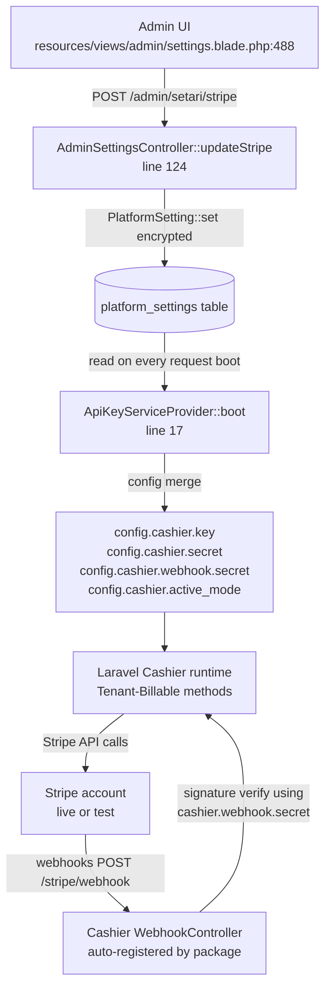

# Billing — Stripe Wiring & Cashier

## TL;DR

Sambla bills per **tenant**, not per user. Laravel Cashier 16 is bound to the
`App\Models\Tenant` model at boot (`app/Providers/AppServiceProvider.php:40`),
which is why the Cashier migrations in `database/migrations/2026_04_15_13010*`
pivot on `tenant_id` instead of the framework default `user_id`.

Stripe credentials are **not** read from `.env` at runtime. Admins manage them
from `/admin/setari/stripe` (see `resources/views/admin/settings.blade.php:488`)
and they are persisted encrypted in `platform_settings`. At every boot,
`App\Providers\ApiKeyServiceProvider` pulls the values, selects the active
mode (live/test), and rewrites the relevant `config('cashier.*')` and
`config('services.stripe.*')` keys *before* Cashier ever reads them.

The Stripe webhook route is auto-registered by Cashier at `stripe/webhook` and
explicitly exempted from CSRF in `bootstrap/app.php:66-68`; integrity comes
from Stripe's signature check using the per-mode webhook secret that
`ApiKeyServiceProvider` wires into `cashier.webhook.secret`.

A runtime guard (`BillingController::ensureStripeCustomerMatchesActiveMode`)
prevents the classic "customer cus_XXX does not exist on this account" error
when an admin swaps live ⇄ test without manually clearing tenants' cached
customer IDs.

## Architecture



## Customer model: Tenant (not User)

Cashier defaults to `App\Models\User`. We override it at application boot:

```php
// app/Providers/AppServiceProvider.php:40
\Laravel\Cashier\Cashier::useCustomerModel(\App\Models\Tenant::class);
```

`Tenant` uses the `Billable` trait (`app/Models/Tenant.php:9-13`) and exposes
the columns Cashier expects directly on its `$fillable` array
(`app/Models/Tenant.php:23-27`): `stripe_id`, `pm_type`, `pm_last_four`,
`trial_ends_at`. `plan`, `plan_slug`, `plan_overrides` are Sambla-specific
metadata kept alongside. Every billing method in the app therefore operates
on the tenant record (e.g.
`$tenant->newSubscription('default', $priceId)->checkout(...)` at
`app/Http/Controllers/Dashboard/BillingController.php:107`).

This choice matches our multi-tenant model: a tenant has many users, but only
the tenant holds a subscription. A user rotation inside a company does not
affect the Stripe customer.

## Dual-mode (live / test)

Stripe keeps live and test accounts entirely isolated — a customer/price
created with a live key cannot be read with a test key. To let an admin flip
the whole platform from live to test (or vice versa) without redeploying, we
store **two full credential sets** and a `stripe_mode` selector.

Mode selection happens in `ApiKeyServiceProvider::applyStripeMode`
(`app/Providers/ApiKeyServiceProvider.php:74-115`):

1. Read `PlatformSetting::get('stripe_mode', 'live')`. Non-live-or-test values
   are coerced to `live` defensively (line 78).
2. Build a `$modes` map of `{live: {public, secret, webhook}, test: …}`
   pointing at the six possible keys (`stripe_public_key`,
   `stripe_test_public_key`, etc.).
3. Walk the requested mode first, then the other mode as fallback. The first
   candidate whose `secret` is set and not a placeholder wins. This keeps the
   app functional when an admin flips to `test` before pasting test keys,
   instead of booting with a half-broken config.
4. Write the winning values into:
   - `cashier.key`, `cashier.secret`, `cashier.webhook.secret`
   - mirrored `services.stripe.key/secret/webhook.secret`
   - `stripe.api_key` (for direct `\Stripe\Stripe::setApiKey()` usage in
     jobs/commands)
   - `cashier.active_mode` — the resolved mode for app code to read

`App\Models\Plan::activeStripeMode()` (`app/Models/Plan.php:161-165`) is the
canonical way to ask "what mode are we in right now" — it reads
`cashier.active_mode` with a safe fallback to `live`. All per-mode helpers on
Plan (`stripeProductId`, `stripePriceId`, `stripeTopupPriceId`, lines 167–185)
resolve to the column suffixed with `_live` or `_test` so a single Plan row
carries both sets of Stripe IDs without ambiguity.

Per-mode Stripe customer IDs on tenants are *not* split into
`stripe_id_live` / `stripe_id_test`; the tenant row has a single `stripe_id`
column. Cross-mode safety is handled at runtime (see
[Cross-mode customer reset](#cross-mode-customer-reset) below).

## Subscription tables keyed on tenant_id

Cashier's default migrations bind subscriptions to `user_id`. We copied and
modified them:

- `database/migrations/2026_04_15_130100_create_cashier_subscriptions_table.php:16`
  declares `$table->foreignId('tenant_id')->constrained()->cascadeOnDelete()`
  with a composite index on `['tenant_id', 'stripe_status']` (line 26).
- `2026_04_15_130200_create_cashier_subscription_items_table.php` mirrors the
  upstream definition — it references `subscription_id` regardless of the
  billable model, so no changes were needed.

Because Cashier reads the `Billable` trait's foreign-key resolution from the
configured customer model, binding to Tenant makes Cashier look for
`tenant_id` automatically. The migration just has to provide it.

> If you ever regenerate Cashier's default migrations (`php artisan vendor:publish`)
> remember to re-apply the `user_id → tenant_id` swap, otherwise new installs
> will fail at migrate time.

## Stripe webhook route

Cashier's service provider auto-registers `POST /stripe/webhook` →
`Laravel\Cashier\Http\Controllers\WebhookController`. We do not declare it in
`routes/web.php` — that would double-register it. What we *do* configure:

- **CSRF exclusion.** Stripe does not carry the `XSRF-TOKEN` cookie. We
  whitelist the path in `bootstrap/app.php:66-68`:

  ```php
  $middleware->validateCsrfTokens(except: [
      'stripe/*',
  ]);
  ```

- **Signature verification.** Cashier's controller checks the
  `Stripe-Signature` header against `config('cashier.webhook.secret')` —
  which is populated at boot by `ApiKeyServiceProvider` with whichever
  webhook secret matches `active_mode`. When an admin rotates modes, the
  correct secret is wired in automatically at the next request.

Event fan-out is handled by two local listeners:
`app/Listeners/HandleStripeCheckoutCompleted.php` (topup fulfillment &
subscription activation metadata) and
`app/Listeners/SyncTenantPlanFromSubscription.php` (writes `plan_slug` back
to the tenant when Stripe reports a plan change).

## Config precedence

The effective priority for every billable-adjacent config key is:

```
platform_settings (DB, encrypted)   >   .env   >   package default
```

`ApiKeyServiceProvider::overrideFromSettings`
(`app/Providers/ApiKeyServiceProvider.php:26-66`) reads settings once per
request during the boot phase. It only overwrites config if the value is
non-empty and not a placeholder (see `isPlaceholder`, line 117). So if an
admin has not pasted keys yet, Cashier still falls back to `.env`'s
`STRIPE_KEY` / `STRIPE_SECRET` / `STRIPE_WEBHOOK_SECRET` — convenient on
fresh installs and local dev.

Currency is mode-independent: a single `stripe_currency` setting writes into
`cashier.currency` (line 41), which is then picked up by
`SyncStripePlans` / `RebuildStripePrices` when creating new prices.

## Cross-mode customer reset

A tenant's `stripe_id` refers to a customer in whichever mode was active when
the customer was created. If an admin toggles `stripe_mode` afterwards, every
`asStripeCustomer()` / `newSubscription()` call against that tenant will fail
with "No such customer: cus_XXX" because Stripe only knows the customer in
the other mode.

`BillingController::ensureStripeCustomerMatchesActiveMode`
(`app/Http/Controllers/Dashboard/BillingController.php:255-275`) mitigates
this:

1. If `stripe_id` is null, nothing to do.
2. Otherwise call `$tenant->asStripeCustomer()` inside a try/catch.
3. Any failure is logged with `tenant_id`, `stripe_id`, and the resolved
   `active_mode`, then we `forceFill` `stripe_id`, `pm_type`, `pm_last_four`
   back to null.
4. The next Cashier call (`newSubscription(...)->checkout()` at line 107, or
   `checkout(...)` at line 204 for topups) sees a fresh tenant and calls
   `createAsStripeCustomer()` under the active mode's keys.

It is called from both `subscribe()` (line 89) and `topup()` (line 194) to
cover every path a user can take to reach Stripe Checkout.

## Tax behavior + customer_update=auto

Tax treatment (VAT rates, reverse-charge routing, tax ID collection) is
wired into the same Checkout session options. The only Stripe-wiring detail
relevant here is `customer_update.address = 'auto'` and
`customer_update.name = 'auto'` at
`app/Http/Controllers/Dashboard/BillingController.php:294-300`. With
`tax_id_collection.enabled = true`, Stripe refuses the Checkout session
unless we grant it write access to the customer's name + address — otherwise
it fails with *"We could not find a valid address on the provided customer"*.
Cashier itself sets `customer_update.name = 'auto'` by default; we merge
`address = 'auto'` on top so both coexist. See
[`13-tax.md`](13-tax.md) for the tax-rate selection logic and EU reverse-charge
rules that sit on top of this plumbing.

## Gotchas

- **`config:cache` is destructive across key rotations.** If the app is
  running with a cached config file, `ApiKeyServiceProvider` still runs at
  boot and still overrides values in the runtime `Config` repository — but
  any code that reads `config('cashier.secret')` inside a command executed
  via a deploy script *before* cache:clear will see stale values. After
  rotating keys in the admin UI, run `php artisan config:clear` (or
  `config:cache` to rebuild) **and** restart PHP-FPM and queue workers.
- **Queue workers hold config in memory** for their whole lifetime. They
  *do* run `ApiKeyServiceProvider::boot` on startup, but they won't re-read
  `platform_settings` between jobs. After a key rotation, restart the queue
  container: `docker compose restart queue`. The same applies to the
  scheduler and Reverb containers.
- **Webhook secret mismatch** manifests as 400s with
  `Webhook signature verification failed` in the nginx/app logs — check that
  the webhook endpoint configured in the Stripe dashboard matches the mode
  of the keys the app is currently running with.
- **Never hand-edit `stripe_id` on tenants.** Use
  `ensureStripeCustomerMatchesActiveMode` or clear the column to null.
  Writing a customer ID from the wrong mode re-introduces the exact bug the
  helper was built to fix.

## Runbook

### Rotate Stripe keys (live)

1. In the Stripe dashboard, roll the secret key and the webhook signing
   secret.
2. Visit `/admin/setari/stripe`, paste the new live public/secret/webhook
   values. Leave the fields blank if you want to keep the stored value —
   `AdminSettingsController::updateStripe` lines 160-166 only persist
   non-empty inputs, so the form acts as a write-once-keep-empty UI.
3. Save. `PlatformSetting::set` writes encrypted values.
4. On the server: `php artisan config:clear && docker compose restart app queue scheduler reverb`.
5. Trigger a test webhook from the Stripe dashboard — expect 200 OK.

### Swap modes for testing

1. `/admin/setari/stripe` → select "Test" → paste test keys if not already
   stored. Stripe keys start with `sk_test_` / `pk_test_` / `whsec_` (same
   prefix for both modes).
2. Save. `stripe_mode` is now `test`; `ApiKeyServiceProvider` wires test
   keys on the next request.
3. **Important:** tenants with a live-mode `stripe_id` will trip the cross-mode
   handler on their first billing action and have their customer reset.
   This is by design — they'll get a fresh test customer on the next
   checkout. Do not panic at the log lines `Resetting stripe_id after
   cross-mode/invalid state`.
4. After testing, swap back to `live` the same way.

### Force customer re-creation (single tenant)

```sql
UPDATE tenants
SET stripe_id = NULL, pm_type = NULL, pm_last_four = NULL
WHERE id = :tenant_id;
```

Next Stripe action the user takes (subscribe, topup, portal) recreates the
customer under the active mode's keys via
`createAsStripeCustomer()`. Subscription records in the `subscriptions`
table survive but become orphaned — delete them too if you want a clean
slate:

```sql
DELETE FROM subscriptions WHERE tenant_id = :tenant_id;
```
