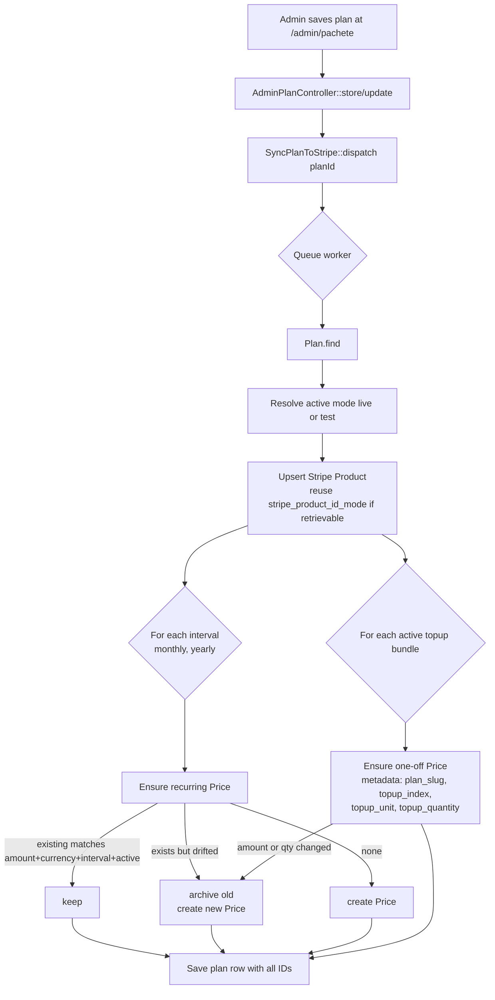

# Billing — Plans, Topups, Custom Plans

## TL;DR

Sambla's billing sits on Laravel Cashier (Stripe). The source of truth
for pricing is the `plans` table in Postgres, not Stripe. An admin
edits a plan at `/admin/pachete`; a queued job (`SyncPlanToStripe`)
mirrors the row into Stripe as a Product plus one recurring Price per
billing interval and one one-off Price per top-up bundle. Because
Stripe keeps live and test completely isolated, every plan carries
**four Stripe Price IDs** (monthly/yearly × live/test) plus two
Product IDs. Top-ups flow through Stripe Checkout in `mode: payment`;
a webhook listener credits the tenant's counter columns
(`message_credits`, `minute_credits`, `product_credits`) and writes an
audit row to `credit_purchases`. Runtime usage that exceeds the
bundled quota is decremented from those counters by
`CreditService::consume()` under a `SELECT … FOR UPDATE` lock, with an
audit row in `credit_consumptions`. Custom plans are plans with
`tenant_id` set and `is_public = false`; a `visibleTo(tenantId)` scope
plus an explicit `403` check in every billing action blocks one tenant
from touching another's bespoke pricing.

## Plan schema (table: 6 seeded plans webchat + voice)

The `plans` table (created in
`database/migrations/2026_03_24_200007_create_plans_table.php:12-27`)
is the single catalog. Core columns:

- `slug` (unique), `name`, `type` (`webchat`, `voice`, `bundle`)
- `price_monthly`, `price_yearly` (decimal 10,2, RON)
- `limits` (JSON): `bots`, `messages_per_month`, `knowledge_entries`,
  `products`, `minutes_per_month`, `channels` — `-1` means unlimited
- `overage` (JSON): `cost_per_message`, `cost_per_word`,
  `cost_per_minute`
- `features` (JSON array of bullet strings), `description`
- `is_active`, `is_popular`, `sort_order`

Six plans are seeded inline by the same migration
(`2026_03_24_200007_create_plans_table.php:37-211`):

| Slug | Type | Monthly | Yearly | Key limits |
|---|---|---|---|---|
| `chat-starter` | webchat | 29 | 23 | 1 bot, 1 000 msg |
| `chat-professional` | webchat | 79 | 63 | 3 bots, 5 000 msg, popular |
| `chat-business` | webchat | 199 | 159 | 10 bots, 20 000 msg, ∞ KB |
| `voice-starter` | voice | 49 | 39 | 100 min |
| `voice-pro` | voice | 149 | 119 | 500 min |
| `voice-enterprise` | voice | 0 | 0 | ∞ min (custom-priced) |

Three later migrations extend the table:

- `2026_04_15_140000_add_stripe_price_ids_to_plans.php:11-17` — first
  pass, single-mode columns (`stripe_product_id`,
  `stripe_price_id_monthly`, `stripe_price_id_yearly`). Short-lived.
- `2026_04_15_160000_split_stripe_ids_per_mode_on_plans.php:12-40` —
  drops the single-mode columns and replaces them with the six
  per-mode columns plus `topups` and `stripe_topup_prices` JSON.
- `2026_04_15_190000_add_tenant_id_to_plans.php:11-17` — adds
  `tenant_id` (FK, nullable) and `is_public` (default `true`). Global
  plans have `tenant_id = NULL`; custom plans have both set (and
  `is_public = false`).

The `Plan` model's `$fillable` / `$casts` at
`app/Models/Plan.php:14-52` covers the full column set.

## Stripe Product + Price sync (mermaid)



The diagram maps 1-to-1 onto `app/Jobs/SyncPlanToStripe.php:34-93`
(narrow, single-plan) and
`app/Console/Commands/SyncStripePlans.php:18-116` (bulk). Both share
the same three-step algorithm (`upsertProduct`, `ensurePrice`,
`ensureTopupPrice`): retrieve existing, compare field-by-field, and
only archive + recreate when a field drifted. The "archive stale"
step is literal — Stripe Prices are immutable, so a changed
`price_monthly` means we `prices.update(id, active: false)` and
create a new Price with a fresh ID
(`SyncStripePlans.php:189-192, 209-221`).

## Per-mode price IDs (why 4 columns monthly/yearly × live/test)

Stripe live and test are two completely separate ledgers — a
`price_…` ID from live **cannot** be used with a `sk_test_` key, and
Cashier uses whatever key is currently active. We didn't want admins
to re-run a sync every time they flipped mode, so the schema stores
both permanently:

```
stripe_product_id_live        stripe_product_id_test
stripe_price_id_monthly_live  stripe_price_id_monthly_test
stripe_price_id_yearly_live   stripe_price_id_yearly_test
```

Defined in
`2026_04_15_160000_split_stripe_ids_per_mode_on_plans.php:19-39`,
read through helpers on the model
(`app/Models/Plan.php:161-185`):

- `Plan::activeStripeMode()` reads `config('cashier.active_mode')`,
  defaulting to `live`.
- `$plan->stripeProductId(?$mode)` returns
  `stripe_product_id_{$mode}`.
- `$plan->stripePriceId('monthly'|'yearly', ?$mode)` returns the
  interval+mode column.
- `$plan->stripeTopupPriceId($bundleIndex, ?$mode)` reads from the
  nested JSON map.

Top-up IDs go into a single `stripe_topup_prices` JSON column with
shape `{"0": {"live":"price_a","test":"price_b"}, "1": {...}}` —
keyed by the bundle's position in the `topups` array
(`Plan.php:180-185`).

## Idempotent command `stripe:sync-plans` + `stripe:rebuild-prices`

`php artisan stripe:sync-plans` (class
`app/Console/Commands/SyncStripePlans.php`) is the reconciliation
tool. It:

1. Reads `cashier.active_mode` (overridable via `--mode=live|test`)
   and the matching secret from `PlatformSetting`
   (`SyncStripePlans.php:20-35`). It **refuses** to run if the
   stored secret's prefix doesn't match the mode
   (`SyncStripePlans.php:31-35`) — a defence against accidentally
   writing to live with a test key or vice versa.
2. Iterates every `Plan`, upserts Product + recurring Prices +
   one-off top-up Prices (`SyncStripePlans.php:48-107`).
3. Supports `--dry-run` to print the plan without touching Stripe
   (`SyncStripePlans.php:37`), so admins can preview before
   committing.
4. Idempotent: re-running with unchanged rows produces zero writes —
   every path checks "does the existing ID still match?" before
   creating (`SyncStripePlans.php:177-202`, `244-270`).

`php artisan stripe:rebuild-prices` (class
`app/Console/Commands/RebuildStripePrices.php`) is the "wipe + let
sync recreate" escape hatch used when an immutable field (such as
`tax_behavior`) needs to change on every Price. It archives
(`active: false`) every Price referenced by the `plans` table, nulls
out the column, and saves; the next `stripe:sync-plans` then
recreates each Price with current settings. The
`--keep-active-subscriptions` flag (`RebuildStripePrices.php:20,
62-73`) lets operators skip Prices that still have paying customers
attached, so existing charges don't break.

## Topup bundles (repeater UI, allowed units, Stripe one-off Prices with metadata)

A plan carries a `topups` JSON column (array) of credit bundles
available for one-off purchase by tenants on that plan. Shape
(`2026_04_15_160000…:29-30`):

```json
{ "name": "1.000 mesaje", "unit": "messages",
  "quantity": 1000, "price": 5.00, "is_active": true }
```

Allowed `unit` values are `messages`, `minutes`, `products` — any
other value is coerced back to `messages` in the admin repeater
parser (`AdminPlanController.php:177-187`). The parser
(`parseTopups()`,
`app/Http/Controllers/Admin/AdminPlanController.php:170-202`) drops
rows where `name`/`quantity`/`price` are blank or zero, so admins
can leave trailing empty rows in the UI without polluting the DB.

Each bundle is mirrored to Stripe as a **one-off Price** (no
`recurring`) attached to the plan's Product — see
`SyncStripePlans.php:277-290` and the mirror call in
`SyncPlanToStripe.php:157-198`. The Price carries metadata used
later by the webhook listener:

```
metadata: {
  plan_slug:       <plan slug>,
  topup_index:     <integer position in the topups array>,
  topup_unit:      messages|minutes|products,
  topup_quantity:  <how many units to credit>,
  managed_by:      sambla
}
```

Tenants trigger a purchase through `BillingController::topup()`
(`app/Http/Controllers/Dashboard/BillingController.php:173-220`).
The controller re-validates `bundleIndex` against
`$plan->activeTopups()` (only bundles with `is_active = true`; see
`Plan::activeTopups()`,
`app/Models/Plan.php:187-198`), pulls the right `stripeTopupPriceId`
for the active mode, and opens a Stripe Checkout session in
`mode: payment` with `invoice_creation: enabled` so the customer
receives a proper invoice.

## Credits: CreditPurchase audit + tenant counters

On successful checkout, Stripe fires `checkout.session.completed`.
`app/Listeners/HandleStripeCheckoutCompleted.php:68-188` subscribes
to Cashier's `WebhookReceived` and splits on `session.mode`:

- `subscription`: just send the "thanks for subscribing" email
  (`HandleStripeCheckoutCompleted.php:25-49, 106-109`); Cashier
  already wrote the subscription row natively.
- `payment`: this is a top-up. Read the metadata we embedded when
  creating the session, resolve the counter column, and credit the
  tenant atomically (`…CompletedListener:117-186`).

The three tenant counters live on the `tenants` table, added by
`database/migrations/2026_04_15_170000_add_credit_balances_and_purchases.php:14-18`:

```
message_credits, minute_credits, product_credits   -- unsigned bigint
```

Every credit grant is also appended to `credit_purchases`
(`…170000:23-39`) — the table has a unique constraint on
`stripe_session_id`, so re-deliveries of the same webhook event
`firstOrCreate` into an existing row and skip the `$tenant->increment()`
(`HandleStripeCheckoutCompleted.php:155-186`). That's the entire
idempotency story: Stripe's at-least-once delivery becomes
exactly-once crediting via the DB unique index, not via our code
being careful.

`CreditPurchase` itself (`app/Models/CreditPurchase.php`) is a plain
Eloquent model with the tenant/plan belongsTo pair plus the
reconstruction columns (`unit`, `quantity`, `price_cents`,
`currency`, `stripe_payment_intent_id`, `status`).

## Credit decrement (CreditService::consume, atomic, CreditConsumption audit)

Credits are consumed as **overflow** when runtime usage (chat
messages, voice minutes, product sync jobs) exceeds the bundled
monthly quota of the active plan. The job is
`App\Services\CreditService` (`app/Services/CreditService.php`).

`consume(Tenant, unit, quantity, source, referenceId)` at
`CreditService.php:40-73`:

1. Resolves `unit` → column via the `UNIT_TO_COLUMN` map
   (`CreditService.php:20-24`). Unknown unit ⇒ return `false`.
2. Wraps everything in `DB::transaction`, locks the `tenants` row
   with `lockForUpdate()` so two concurrent workers on the same
   tenant can't both consume the final credit
   (`CreditService.php:53-60`).
3. Compares locked balance vs. requested quantity; insufficient ⇒
   transaction rolls back, returns `false`, caller must decide to
   block the action (`CreditService.php:57-59`).
4. On success, `decrement()`s the counter and writes a
   `credit_consumptions` row recording `tenant_id`, `unit`,
   `quantity`, `source`, and optional `reference_id`
   (`CreditService.php:61-69`).

The audit table
(`database/migrations/2026_04_15_200000_create_credit_consumptions.php:11-21`)
has a `(tenant_id, unit, created_at)` composite index for the
"show me this tenant's message usage this month" dashboard queries.
`source` is a short enum-style string:
`chat_message | voice_call | product_sync | reconciliation`.

## Custom plans per-tenant (tenant_id, is_public=false, visibleTo scope)

When sales negotiates a one-off deal with a tenant, we create a
`Plan` row with `tenant_id = <that tenant>` and `is_public = false`.
The visibility rules collapse into two scopes on the `Plan` model
(`app/Models/Plan.php:67-82`):

- `scopePublic()` — only `tenant_id IS NULL AND is_public = true`.
  Used by the marketing `/preturi` page.
- `scopeVisibleTo($tenantId)` — the union of public plans plus that
  tenant's own custom plans:

  ```sql
  WHERE (tenant_id IS NULL AND is_public = true)
     OR tenant_id = :tenantId
  ```

The billing dashboard query in
`app/Http/Controllers/Dashboard/BillingController.php:38-39` runs
`Plan::active()->visibleTo($tenant->id)->webchat()` (and voice),
which is what makes custom plans appear only to their owner in the
selector without any special-case rendering.

`AdminPlanController::store()` at
`app/Http/Controllers/Admin/AdminPlanController.php:42-44` enforces
the invariant at the write side: if `tenant_id` is set, `is_public`
is forced back to `false`. You can't accidentally create a "custom
public" plan.

## Defense-in-depth: subscribe 403 for other-tenant custom plan

Scope-based filtering in the dashboard query is not enough — a user
could still `POST /billing/subscribe/42` with another tenant's custom
plan ID. Every billing action that accepts a `{plan}` route binding
re-checks ownership:

- `subscribe()` — `BillingController.php:78-80`
- `changePlan()` — `BillingController.php:121-123`
- `topup()` — `BillingController.php:178-180`

Each one runs:

```php
if ($plan->tenant_id !== null && $plan->tenant_id !== $tenant->id) {
    abort(403, 'Pachet indisponibil pentru contul tău.');
}
```

`null` (public) stays allowed; anything owned by a **different**
tenant 403s. That's why it's "defense-in-depth": even if a query
scope is forgotten in a future refactor, the controller still
refuses the action.

## Gotchas

- **Stripe Price.tax_behavior is immutable.** You cannot "turn on
  VAT" for an existing Price via an update call; Stripe rejects it.
  The only fix is archive + recreate, which is exactly what
  `RebuildStripePrices` was written for. Comment at the top of the
  class explicitly calls this out
  (`app/Console/Commands/RebuildStripePrices.php:10-15`).
- **You can't change `unit_amount` on a Price either.** If someone
  edits `price_monthly` in the admin, `ensurePrice()` compares the
  stored `unit_amount` against the new integer cents value
  (`SyncStripePlans.php:180-184`); on mismatch it archives the old
  Price and creates a new one. Active subscriptions on the archived
  Price keep billing as-is (Stripe allows charges on inactive
  Prices); only new checkouts go to the new Price.
- **Live/test customer IDs are not interchangeable.** If an admin
  flips `active_mode` while a tenant's `stripe_id` is from the other
  mode, the Checkout call will fail with "no such customer".
  `BillingController::ensureStripeCustomerMatchesActiveMode()`
  (`BillingController.php:255-275`) pre-flights the customer with
  `$tenant->asStripeCustomer()` and, on any error, nulls out
  `stripe_id`/`pm_type`/`pm_last_four` so Cashier recreates a fresh
  customer in the active mode.
- **Tax rate must match the mode too.** `activeTaxRateId()` pulls
  `stripe_tax_rate_id_{live|test}` from `PlatformSetting`
  (`BillingController.php:277-282`) — configured separately per
  mode in `/admin/setari/stripe`.
- **Currency is mutable at the Plan price level but not after sync.**
  `SyncStripePlans` always reads `config('cashier.currency')`
  (`SyncStripePlans.php:39`); if you change the platform currency
  later, everything re-archives on the next sync.

## Runbook

### Add a new public plan

1. `/admin/pachete/create`. Fill name, slug (optional — defaults
   to `Str::slug(name)` at `AdminPlanController.php:46-48, 77-78`),
   type, prices, limits, features. Leave `tenant_id` empty and
   `is_public` checked.
2. Add any top-up bundles in the repeater. Units are
   `messages|minutes|products`; other values coerce to `messages`.
3. Save. `SyncPlanToStripe::dispatch()` fires on the `stripe` queue
   (`AdminPlanController.php:52, 82`).
4. Watch the queue logs; the job writes
   `SyncPlanToStripe ok plan_id=… mode=… product_id=…` on success
   (`SyncPlanToStripe.php:84`).
5. Reload `/admin/pachete` — Stripe columns should be populated.
6. Optional sanity check: `php artisan stripe:sync-plans --dry-run`
   should now print "unchanged" for every row of that plan.

### Change a price

1. Edit the plan at `/admin/pachete/{id}/edit`. Change
   `price_monthly` or `price_yearly`.
2. Save. `SyncPlanToStripe` runs and archives the old Price,
   creates a new one, overwrites the `stripe_price_id_*` column.
3. **Existing subscribers stay on the old (archived) Price at the
   old rate** — Stripe allows continued billing on inactive Prices.
   New sign-ups get the new Price.
4. To migrate existing subscribers, open Stripe CLI or the
   dashboard and `subscription.items.update` to the new Price ID.
   There is currently no in-app bulk-migrate tool.

### Force-recreate every Price (e.g., enabling VAT for the first time)

1. Toggle `vat_inclusive` / `collect_tax_id` at
   `/admin/setari/stripe`.
2. `php artisan stripe:rebuild-prices --mode=live --keep-active-subscriptions`
   — archives every Price, skipping any with active customers.
3. `php artisan stripe:sync-plans --mode=live` — recreates all
   archived Prices with the new `tax_behavior`.
4. Repeat for `--mode=test`.

### Create a custom plan for a specific tenant

1. `/admin/pachete/create`, select the tenant in the dropdown. The
   controller forces `is_public = false` regardless of the checkbox
   (`AdminPlanController.php:42-44`).
2. Enter bespoke pricing/limits/topups as normal.
3. Save. Sync job runs; Stripe Product + Prices are created just
   like any other plan — nothing in Stripe changes based on
   `tenant_id`, the isolation lives purely in our `visibleTo`
   scope.
4. The tenant sees the new plan on their `/dashboard/billing` page
   (via `Plan::active()->visibleTo($tenant->id)` in
   `BillingController.php:38-39`); other tenants see nothing.
5. If they try to URL-hack `/billing/subscribe/<that-plan-id>`
   from a different account, `subscribe()` 403s at
   `BillingController.php:78-80`.
