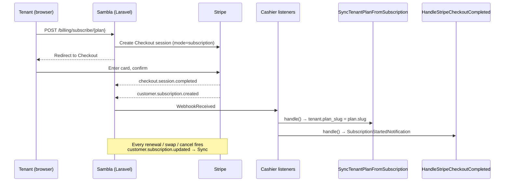

# Billing — Subscription Lifecycle

## TL;DR

Sambla uses **Laravel Cashier** as the thin wrapper around Stripe. Cashier owns the `subscriptions` / `subscription_items` tables and webhook bookkeeping. We layer two listeners on top of Cashier's `WebhookReceived` event:

1. `SyncTenantPlanFromSubscription` keeps `tenants.plan_slug` aligned with the live Stripe subscription. It reverse-looks-up `price_id` → `Plan` row and writes back on every `customer.subscription.{created,updated,deleted}`.
2. `HandleStripeCheckoutCompleted` handles one-off top-up credits (`mode=payment`) and sends the welcome email on subscription checkouts (`mode=subscription`).

Everything user-facing lives in `Dashboard\BillingController` — subscribe, change plan, top up, cancel, resume, invoices. Trial lifecycle is a nightly cron. Stripe is the source of truth for money state; our tables mirror it.

## Lifecycle events



Only **three** subscription events matter for us:

- `customer.subscription.created` — first activation after Checkout success.
- `customer.subscription.updated` — swap, renewal, past_due transitions, cancel-at-period-end toggles.
- `customer.subscription.deleted` — subscription is gone for good.

`SyncTenantPlanFromSubscription::LIFECYCLE_EVENTS` filters all other types away. Anything Cashier already writes (subscription rows, `stripe_status`) we rely on as-is; we only touch `tenants.plan` / `tenants.plan_slug` (non-Cashier columns) so we never race with Cashier's own updates.

## Subscription states — what we do

Stripe can report any of these on `customer.subscription.*`. Our behavior matrix:

| Stripe status        | `SyncTenantPlanFromSubscription` action                            | User dashboard           |
| -------------------- | ------------------------------------------------------------------ | ------------------------ |
| `trialing`           | Write `plan_slug` = matched plan.                                  | Full access.             |
| `active`             | Write `plan_slug` = matched plan.                                  | Full access.             |
| `past_due`           | Keep `plan_slug`. Log warning.                                     | Full access + banner.    |
| `incomplete`         | Keep `plan_slug`. Log warning.                                     | Full access (short TTL). |
| `canceled`           | Force `plan_slug = 'free'`.                                        | Free plan only.          |
| `incomplete_expired` | Force `plan_slug = 'free'`.                                        | Free plan only.          |
| `unpaid`             | Force `plan_slug = 'free'`.                                        | Free plan only.          |

The `past_due` rule matters: if the card fails on renewal, Stripe retries for up to a week and lets the user re-auth via the Customer Portal. Revoking the plan immediately would be user-hostile — they're still trying to pay. If Stripe eventually gives up, status flips to `canceled` or `unpaid` and the listener clears the plan on the next webhook.

See `app/Listeners/SyncTenantPlanFromSubscription.php:54` for the terminal-state branch and line 84 for the past_due/incomplete warning.

## Change plan in-app (swap vs new checkout)

Two flows depending on whether the tenant already has a subscription:

- **No active subscription** → `subscribe(Plan)` starts a Stripe Checkout session. Card is collected, customer is created/reused, Stripe fires `customer.subscription.created`.
- **Active subscription** → `changePlan(Plan)` calls `$subscription->swap($priceId)`. No Checkout, no new card. Stripe prorates the change mid-cycle on its side; we don't compute anything locally.

The metadata `{tenant_id, plan_id, plan_slug, interval}` is set on the Checkout session so `HandleStripeCheckoutCompleted` can resolve the tenant + plan when sending the welcome email.

### Downgrade guard

Before calling `swap()`, `changePlan` runs `downgradeViolations($tenant, $newPlan)`:

- `limits.bots`: if tenant has more bots than the new plan allows → violation.
- `limits.products`: if more WooCommerce products synced than allowed → violation.

If violations exist and the request does NOT include `confirm_downgrade=1`, we refuse the swap with a human-readable error (Romanian, since that's the user-facing locale):

> „Nu poți trece pe Starter cu setup-ul actual: ai 4 boți, pachetul nou permite maxim 2. Eliberează resursele și reîncearcă."

The confirm flag lets the user override in case they intend to delete resources after the fact, but the default is strict-refuse. Upgrades bypass the guard entirely (`limits.* = -1` means unlimited).

After a successful `swap()` we optimistically write `plan_slug` on the tenant so the redirect back to `/dashboard/facturare` shows the new plan without waiting for the webhook round-trip. The webhook will re-confirm within seconds.

## Cancel + resume

`cancelSubscription()` calls `$subscription->cancel()`. Cashier sets `ends_at` to the end of the current Stripe billing period, and Stripe sets `cancel_at_period_end=true`. The tenant:

- Still has `stripe_status=active` until the period ends — full access.
- Sees a banner "abonament anulat la {date}".
- Can call `resumeSubscription()` any time before `ends_at` to undo it.

`resumeSubscription()` guards on `$subscription->onGracePeriod()` — Cashier's helper for "cancelled but not yet ended". Outside grace period the route refuses ("Abonamentul nu poate fi resumed acum."). Once the grace period lapses, Stripe fires `customer.subscription.deleted`, Sync writes `plan_slug='free'`, and the tenant must start a brand-new Checkout to come back.

Plan_slug is **unchanged** during grace period — user keeps the paid plan until the last second.

## Trial lifecycle

Default trial is **7 days** (configured via platform settings / tenant onboarding — `trial_ends_at` is set at registration).

The nightly command `billing:trial-lifecycle` runs in `routes/console.php`:

```php
Schedule::command('billing:trial-lifecycle')->dailyAt('08:00')->withoutOverlapping();
```

Two passes:

1. **Reminder** — tenants with `trial_ends_at` in the next 2 days and no `settings.trial_reminder_sent` flag receive `TrialEndingReminder` (mail). The flag is then set to prevent re-sending.
2. **Expiry** — tenants with `trial_ends_at` in the past AND no active Cashier subscription get `plan_slug='free'` and `TrialExpired` notification. We explicitly check `$tenant->subscribed('default')` before expiring so a user who already paid mid-trial keeps their paid plan.

Both passes are idempotent and cheap (filtered queries, single update). `--dry-run` prints without writing.

Recipients for both mails come from `billingRecipients()`: `tenant.company_email` + the oldest admin user, deduped.

## Invoices — list + download PDF

Two read endpoints on `BillingController`:

- `invoices()` calls `$tenant->invoices(includePending: false, parameters: ['limit' => 50])` — Cashier returns a Collection of `Cashier\Invoice` objects wrapping the Stripe invoice API.
- `downloadInvoice($invoiceId)` calls `$tenant->downloadInvoice($id, ['vendor' => 'Sambla', 'product' => 'Abonament Sambla'])`. Cashier fetches the invoice, renders a PDF via DomPDF with our vendor/product metadata, and streams the response. The tenant never touches Stripe directly and never needs a Stripe login.

Both endpoints hard-require `$tenant->hasStripeId()` — no customer, no invoices. Attempting either on a tenant without `stripe_id` 403s.

## Notifications

All billing notifications are `ShouldQueue` → run on the default Redis queue. Recipients are resolved via `billingRecipients()`:

| Notification                   | Triggered by                                          | Subject (RO)                                   |
| ------------------------------ | ----------------------------------------------------- | ---------------------------------------------- |
| `SubscriptionStartedNotification` | `checkout.session.completed` (`mode=subscription`) | „Sambla — abonament activat: {planName}"       |
| `TopUpPurchasedNotification`   | `checkout.session.completed` (`mode=payment`)         | „Sambla — credite adăugate ({qty} {unit})"     |
| `TrialEndingReminder`          | `billing:trial-lifecycle` reminder pass              | „Sambla — perioada de probă se încheie în N zile" |
| `TrialExpired`                 | `billing:trial-lifecycle` expiry pass                | „Sambla — perioada de probă s-a încheiat"       |

We intentionally do **not** notify on `subscription.updated` (too noisy — every Stripe retry fires one) or on cancel/resume (the UI already shows the state).

## Admin audit log

`App\Observers\PlanObserver` is attached to `App\Models\Plan` and writes to `admin_audit_log` via `AdminAuditLog::record($action, $subject, $changes)`:

- `plan.created` — stores `{name, slug, type, price_monthly, price_yearly, is_active, tenant_id}`.
- `plan.updated` — stores `{field: [old, new]}` for each dirty field (except `updated_at`). No-op if nothing changed.
- `plan.deleted` — stores `{slug, name}`.

The `AdminAuditLog` row captures `user_id = auth()->id()`, `ip = request()?->ip()`, and a JSON `changes` column. It's rendered under `/admin/audit` (super-admin only). This is the source of truth for "who changed what plan when" — Stripe price changes show up as field diffs, not as mysterious out-of-band edits.

Tenant-scoped billing actions (subscribe, cancel, swap) are not written to `admin_audit_log` — they're reconstructible from Stripe events + Cashier's `subscriptions` table.

## Gotchas

- **past_due keeps the plan.** This is deliberate. Revoking access on the first failed charge breaks renewals for users whose 3DS challenge lags. Stripe gives them ~7 days to re-auth via the Customer Portal. Only when Stripe escalates to `canceled`/`unpaid` do we clear the plan.
- **Cross-mode `stripe_id` drift.** `ensureStripeCustomerMatchesActiveMode()` runs before every Checkout. Stripe live and test accounts are fully isolated; if the platform is switched from test → live (or vice versa), the tenant's old `stripe_id` won't resolve under the new key. We catch the exception, clear `stripe_id/pm_type/pm_last_four`, and Cashier will recreate a fresh customer on the next API call. Without this guard, users hit opaque "No such customer" errors at Checkout.
- **Listener idempotency.** `SyncTenantPlanFromSubscription` is safe to replay: the writes are deterministic from webhook payload, and we short-circuit when `plan_slug` is already correct (line 91). Cashier's internal subscription bookkeeping is also idempotent. `HandleStripeCheckoutCompleted` relies on the unique `credit_purchases.stripe_session_id` index — `firstOrCreate` short-circuits duplicates, so only the first webhook delivery increments credits.
- **Trial expiry honors paid subscriptions.** A user who subscribes mid-trial has `trial_ends_at` still set (we don't clear it), but `subscribed('default')` returns true. The expiry pass explicitly checks this and skips them.
- **Downgrade-after-cancel is fine.** During grace period the tenant is still on `active`, but `changePlan` requires `$subscription->active()` which grace-period subs satisfy. Swap during grace period keeps the cancel-at-period-end flag.
- **Webhook secret.** The webhook route is wired to Cashier's controller with `STRIPE_WEBHOOK_SECRET`. Our listeners run inside Cashier's pipeline, so a malformed-signature request never reaches `SyncTenantPlanFromSubscription`.
- **Optimistic plan_slug write in `changePlan`.** We write locally after a successful `swap()` so the redirect is accurate, but the source of truth is still the webhook. If the webhook never arrives (e.g., firewall blip), the local write still stands and everything stays consistent on the next Stripe event.

## Runbook

### Manually cancel a subscription (support action)

```bash
php artisan tinker
>>> $tenant = App\Models\Tenant::where('slug','acme')->first();
>>> $tenant->subscription('default')->cancel();
# user retains access until ends_at; webhook fires subscription.updated
```

Or force an immediate hard cancel (refunds NOT issued automatically):

```bash
>>> $tenant->subscription('default')->cancelNow();
```

### Manually resume during grace period

```bash
>>> $tenant->subscription('default')->resume();
```

If `onGracePeriod()` returns false you're past the window — the only path back is a new Checkout.

### Replay a `subscription.created` event

From the Stripe Dashboard → Events → find the event → "Resend to webhook". Our listener is idempotent (sync-only, equality-guarded write). Alternatively from CLI:

```bash
stripe events resend evt_1OxxxYYYzzz --api-key $STRIPE_SECRET
```

Then tail the app log:

```bash
docker compose logs -f queue | grep -i 'SyncTenantPlan\|checkout'
```

Expected: one log line `Tenant plan synced from Stripe subscription` or no line at all if `plan_slug` was already correct.

### Audit plan history for a tenant

```sql
SELECT created_at, user_id, action, changes
FROM admin_audit_log
WHERE subject_type = 'App\Models\Plan'
  AND subject_id IN (
    SELECT id FROM plans WHERE tenant_id = :tenant_id OR tenant_id IS NULL
  )
ORDER BY created_at DESC;
```

For per-tenant subscription history (who changed plan when), query Cashier's table:

```sql
SELECT s.created_at, s.stripe_status, s.stripe_price, s.ends_at
FROM subscriptions s
JOIN tenants t ON t.id = s.tenant_id
WHERE t.slug = 'acme'
ORDER BY s.created_at DESC;
```

To cross-reference with Stripe: `stripe subscriptions list --customer=$STRIPE_CUSTOMER_ID`.

### Force a trial-reminder dry run

```bash
docker compose exec app php artisan billing:trial-lifecycle --dry-run
```

Prints the list of tenants that *would* receive a reminder or be expired, without writing anything or sending mail. Good for verifying the nightly cron before enabling it in a new environment.
