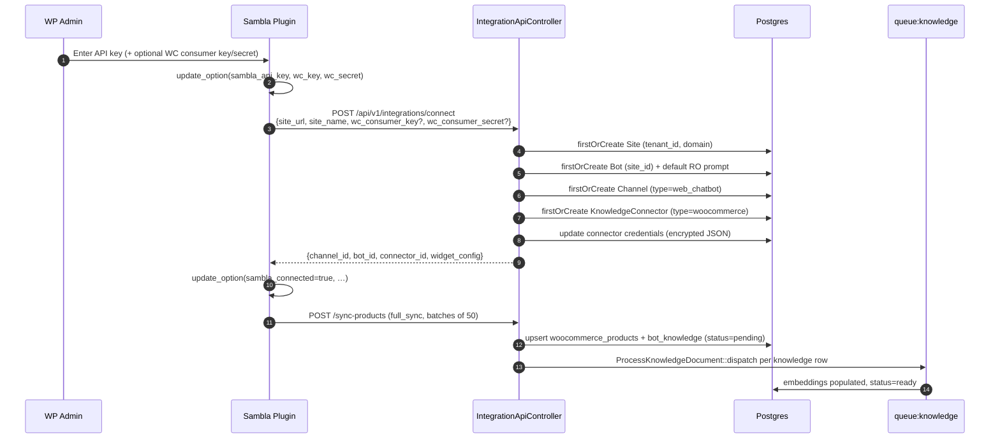

# WooCommerce Integration

## TL;DR

Sambla integrates with WooCommerce in a **push-first, read-only** mode: a WordPress companion plugin (`sambla-woocommerce` v2.0.5) auto-pushes products, categories, pages and posts to `https://sambla.ro/api/v1/integrations/*` whenever they change. The Laravel side stores live transactional fields in `woocommerce_products`, generates a semantic blob in `bot_knowledge`, embeds asynchronously, and retrieves products at chat time via `ProductSearchService` + `ProductContextService`. There is also a legacy **pull** path in `WooCommerceConnectorService::sync()` that uses the WC REST API directly — this is kept for connectors that supplied `consumer_key` / `consumer_secret` at connect time.

Order sync is **not** implemented: no `woocommerce_order_*` webhook, no inventory stream, no order writebacks. A signed **purchase webhook** exists (`PurchaseWebhookController`) and does populate `PurchaseAttribution` through `AttributionService`; the stored sentiment in some older notes ("attribution table unused") is out of date — it is wired, but the plugin has to POST to it and the companion plugin doesn't yet ship that hook by default.

## Plugin side (`wordpress-plugin/sambla-woocommerce/`)

Bootstrapped from `sambla-woocommerce.php` (v2.0.5), PHP 7.4+, WC 5.0+. Activation creates options (`sambla_api_key`, `sambla_connected`, `sambla_channel_id`, `sambla_bot_id`, `sambla_connector_id`, `sambla_widget_config`) and schedules a `twicedaily` cron (`sambla_product_sync_cron`).

Class responsibilities:

- `Sambla_Admin` — WP admin menu "Sambla AI", settings page, AJAX endpoints (`sambla_connect`, `sambla_disconnect`, `sambla_sync_now`, `sambla_save_settings`). 5-minute transient cache (`sambla_dashboard_status`) for status/usage calls.
- `Sambla_Api_Client` — thin wrapper over `wp_remote_request` hitting `SAMBLA_API_BASE` (= `https://sambla.ro`). Bearer token is the user's Sambla API key. Endpoints: `/api/v1/integrations/{connect,disconnect,sync-products,sync-pages,sync-categories,widget-config,status}`.
- `Sambla_Product_Sync` — auto-sync hooks:
  - `woocommerce_new_product`, `woocommerce_update_product` → `sync_single_product()` → POST one product + re-sync categories.
  - `woocommerce_delete_product`, `woocommerce_trash_product` → `delete_product()` → POST empty products array with `deleted_ids=[id]`.
  - `save_post_page`, `save_post_post` → `sync_single_page()` (skips revisions/autosaves, skips `<50` chars).
  - `wp_trash_post` → `delete_page()`.
  - `full_sync()` — paginated `wc_get_products` and `get_posts` at **50 per page**, pushes batches to `/sync-products` and `/sync-pages`. Triggered by cron and by the "Sync now" button (rate-limited to once per 5 minutes via `sambla_last_sync`).
- `Sambla_Cron` — hook handler for `sambla_product_sync_cron`.
- `Sambla_Widget` — renders the chat widget on front-end based on `sambla_widget_config`.
- `Sambla_Updater` — self-update via `PluginUpdateController` on the Laravel side.

Product payload (`format_product()`): `wc_product_id, name, short_description, description, price, regular_price, sale_price, currency, sku, stock_status, image_url, categories[], category_ids[], attributes{}, permalink`. Attributes resolve taxonomies via `wp_get_post_terms` so brand/color/material come through as readable strings.

## Connect flow



All API-side writes use `Site::withoutGlobalScopes()` + `tenant_id` filter to bridge unauthenticated Sanctum tokens and tenant scoping; the bot is always resolved through `$request->user()->tenant`.

## `WooCommerceConnectorService::sync()` (pull path)

Triggered server-side when the connector has `credentials.consumer_key` + `consumer_secret`, e.g. from the Sambla dashboard "Re-sync" button. Used as fallback when no WP plugin is installed.

Key mechanics:

- **SSRF guard** — `SsrfGuard::validateUrl($connector->site_url)` blocks internal IPs, localhost, metadata endpoints.
- **Redis lock** — `Cache::lock("wc_sync_lock_{connector_id}", 1800)`; concurrent sync attempts throw `RuntimeException` with a RO-language message.
- **Status machine** — `connected → syncing → {connected | error}` with `last_synced_at` timestamp.
- **Pagination** — `GET /wp-json/wc/v3/products?per_page=100&page=N&status=publish`, Basic Auth, 30s timeout, loops until `page > X-WP-TotalPages` header.
- **Idempotent upsert** — keyed on `(bot_id, source_type='connector', source_id=connector_id, title='[WooCommerce] …')`. Records are written with `status='pending'`; **no per-row job dispatch** to avoid queue explosion on large catalogues.
- **Stale cleanup** — after iterating, any existing `bot_knowledge` row whose `metadata->wc_product_id` is not in the current `$syncedProductIds` is deleted.
- **Category sync** — `syncCategories()` fetches `/wp-json/wc/v3/products/categories`, upserts `woocommerce_categories` (with `wc_parent_id`), deletes missing ones, busts `category_browse:{bot_id}` caches.
- **Progress cache** — `knowledge_sync_progress_{bot_id}` TTL 2h, feeds the dashboard sync progress UI.
- **First batch kick-off** — `ProcessKnowledgeBatch::dispatch($bot_id, 50)` so users see embeddings flowing within a minute; the `knowledge:process` scheduled command picks up the rest.

## Content shaping for embeddings

`formatProductContent()` produces a **semantic** blob containing only fields that describe *what the product is*:

```
Produs: <name>
Descriere scurtă: <strip_tags(short_description)>
Descriere: <strip_tags(description), truncated to 1500 chars>
Categorii: <cat1, cat2, …>
<Attribute Label>: <value1, value2, …>
```

Deliberately excluded: `price`, `sale_price`, `sku`, `permalink`, `stock_status`. These are **transactional** and change frequently — embedding them would cause stale retrieval and cache-busting re-embedding loops. They live in `woocommerce_products` and are injected at query time.

The push path (`IntegrationApiController::syncProducts` → `$product->toKnowledgeText()`) follows the same rule.

## Products in chat

1. `ChatCompletionService` / `KnowledgeAgentService` calls `ProductContextService::buildContext($bot, $userMessage)`.
2. `ProductContextService` calls `OrderLookupService::detectOrderQuery()` first (regex on order numbers / emails) — if it matches it will hit the WC REST orders endpoint via `OrderLookupService::lookup()`.
3. Then `ProductSearchService::search($botId, $message, limit=5)`:
   - Normalises query, strips a large Romanian stopword list, classifies intent tokens.
   - Broad SQL candidate retrieval against `woocommerce_products` (name, categories, attributes).
   - Semantic post-filter with **product type gate**, **dimension strict match**, and attribute/context validation.
   - Optional feedback boost from `retrieval_feedback` (thumbs-up/down history).
   - **Confidence gate** — `config('product_search.min_confidence_score', 5)`; below threshold returns `[]`. The principle is enforced in comments: *"0 results > irrelevant results. Always."*
4. Matched rows are mapped via `WooCommerceProduct::toCardArray()` and injected into the prompt under `PRODUSE GĂSITE:` plus structured `products[]` for the chat widget to render cards.

There is also a `SemanticProductRetrievalService` and `GroundedProductContextService` used by the voice/realtime path when structured product grounding is preferred over free-form RAG.

## Purchase webhook

Route: `POST /api/v1/webhooks/woocommerce/{bot}/purchase` (no auth middleware, signed).

`PurchaseWebhookController::handle()`:

1. Load bot with `withoutGlobalScopes()->findOrFail`.
2. Resolve HMAC secret: first `KnowledgeConnector::credentials['consumer_key']` for that bot, else fallback to `PlatformSetting::get('api_key', config('app.key'))`.
3. Compute `hash_hmac('sha256', rawBody, $secret)`, constant-time compare against `X-Sambla-Signature`. 403 on mismatch.
4. Validate payload (`wc_order_id`, `total`, `items[]`, `session_id`, `conversation_id`, `visitor_id`).
5. Call `AttributionService::attributePurchase()` which attempts three tiers:
   - **strict** — `session_id` matches `conversations.external_conversation_id`.
   - **probable** — a `product_click` / `add_to_cart_success` event for an ordered `product_id` within `attribution_window_hours` (default 24h).
   - **assisted** — only a `product_impression` within the same window.
6. Writes `purchase_attributions` row + `conversation_outcomes` (`purchase_completed`) + emits `PURCHASE_COMPLETED` chat event.

The companion plugin does **not ship** a `woocommerce_thankyou` → webhook hook by default in v2.0.5, so this table will be empty until either the plugin is extended or the customer adds a custom hook (and shares the connector consumer key as HMAC secret).

## Gotchas

- **Read-only:** we pull/receive product and category data only. There is no order stream, no inventory stream, no stock reservation. Order information reaches the bot exclusively via on-demand `OrderLookupService` (WC REST API `/orders`), gated by detected customer email / order number in the user message.
- **Two write paths, same table:** the push path (`IntegrationApiController::syncProducts`) dispatches `ProcessKnowledgeDocument` per row; the pull path (`WooCommerceConnectorService::sync`) does **not** — it relies on `knowledge:process` cron + `ProcessKnowledgeBatch` to avoid queue explosion on 10k+ catalogues. If you add a feature that assumes per-row jobs, check both paths.
- **Stale cleanup diverges:** pull path deletes `bot_knowledge` rows whose `metadata->wc_product_id` disappeared; push path deletes only the explicit `deleted_ids[]` list from the plugin. If the plugin misses a delete hook, only a manual full sync from the dashboard (pull path) will clean it up.
- **WC REST pagination quirks:** total page count comes from `X-WP-TotalPages` header, **not** from the JSON body. Some hosts strip non-standard headers behind Cloudflare — sync will then stop at page 1. If imports look capped at 100, suspect header stripping.
- **Semantic content purity:** never add price/stock/SKU/permalink to `formatProductContent()` — that will cause every price change to re-embed the whole catalogue.
- **HMAC secret ambiguity:** purchase webhooks sign with the WC consumer key (if stored) — same string as WooCommerce API basic-auth user. If the customer rotates their WC key without resyncing, webhooks will 403.
- **`Bot::withoutGlobalScopes()` everywhere:** the integration API is authenticated by Sanctum token but bypasses tenant scopes and re-asserts `tenant_id` manually. Any new query in this controller must filter by `tenant_id` explicitly.

## Limitations

- No lead/contact push-back to WooCommerce (leads stay in `leads` table).
- No coupon / discount / promotion sync.
- No variable product variation sync — variations are flattened into the parent product's attributes blob.
- No multi-currency handling beyond `currency` string echoed back.
- No two-way write: Sambla cannot create orders, update stock, or write customer notes.
- Revenue attribution is wired end-to-end but the default plugin package does **not** send the webhook; enabling it is a manual customer step.
- The `WooCommerceProduct::semantic_text` column exists but is populated only by the push path.

## Runbook

### Connect a new WooCommerce store

1. In the customer's WordPress admin: *Plugins → Add New → Upload `sambla-woocommerce.zip`*, activate.
2. *Sambla AI → Settings*. Paste their Sambla API key (from the Sambla dashboard → API Keys). Optionally paste WC REST consumer key/secret (enables order lookup + HMAC webhook).
3. Click **Connect**. The plugin calls `/api/v1/integrations/connect`; verify in Sambla logs that a `Site`, `Bot`, `Channel`, `KnowledgeConnector` were created. Response must include `channel_id`, `bot_id`, `connector_id`.
4. Click **Sync now** — triggers `Sambla_Product_Sync::full_sync()` in 50-product batches. Rate limit: once / 5 min.
5. In Sambla dashboard → Knowledge, confirm rows move `pending → ready` (embedding done by `knowledge:process` every minute).

### Force a re-sync from Laravel (pull path)

```bash
php artisan tinker
>>> $c = App\Models\KnowledgeConnector::find($connectorId);
>>> app(App\Services\Connectors\WooCommerceConnectorService::class)->sync($c);
```

Requires `credentials.consumer_key` and `consumer_secret` on the connector. Watch `storage/logs/laravel.log` for `WooCommerce sync: completed` and the Redis lock key `wc_sync_lock_{id}`.

### Disconnect cleanly

1. From WP admin → Sambla AI → Disconnect. Plugin POSTs `/api/v1/integrations/disconnect` and clears local `sambla_connected`, `sambla_channel_id`, `sambla_bot_id`, `sambla_connector_id`.
2. Server-side sets `knowledge_connectors.status = 'disconnected'` — it does **not** delete the bot, the channel, the products, or the knowledge. Widget keeps working with the last-synced data.
3. To fully purge: in Laravel tinker, delete the `KnowledgeConnector`, the `WooCommerceProduct` rows for that `bot_id`, the `BotKnowledge` rows with `source_type='connector' AND source_id={connector_id}`, then the `Bot` if no other channels remain. Cascade FKs remove pivot rows.
4. On the WP side, deactivating the plugin unschedules `sambla_product_sync_cron` but leaves options in the DB; use *Delete plugin* to remove them.
